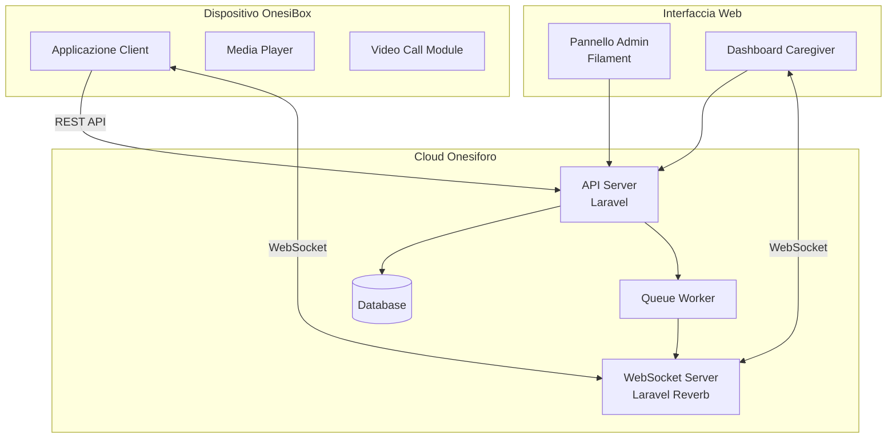
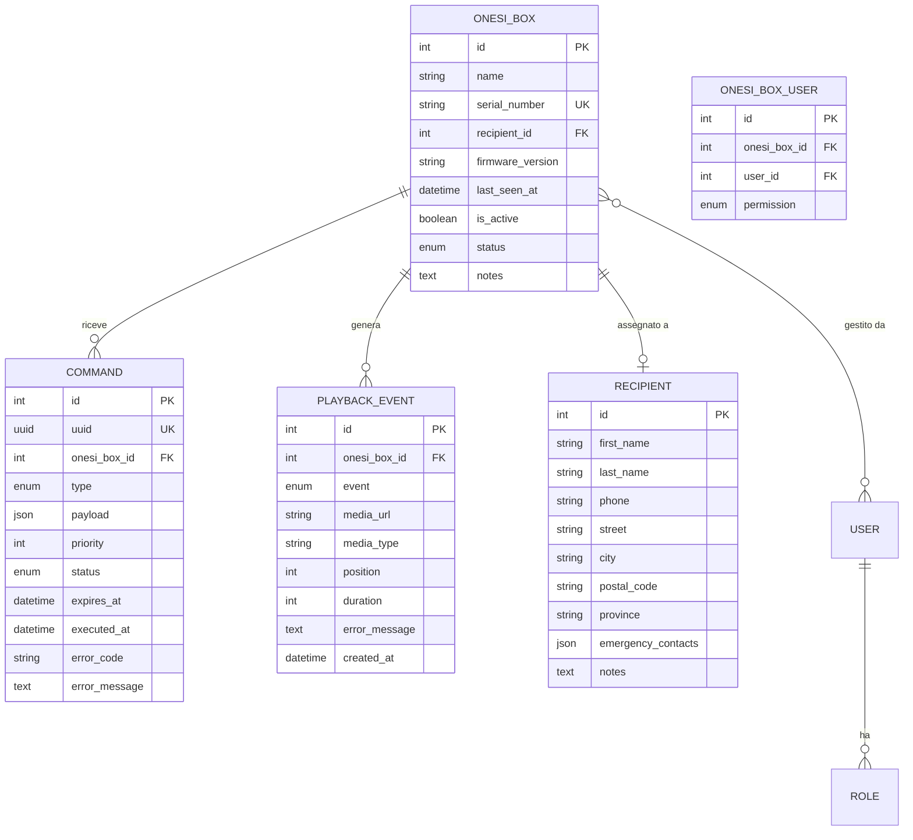
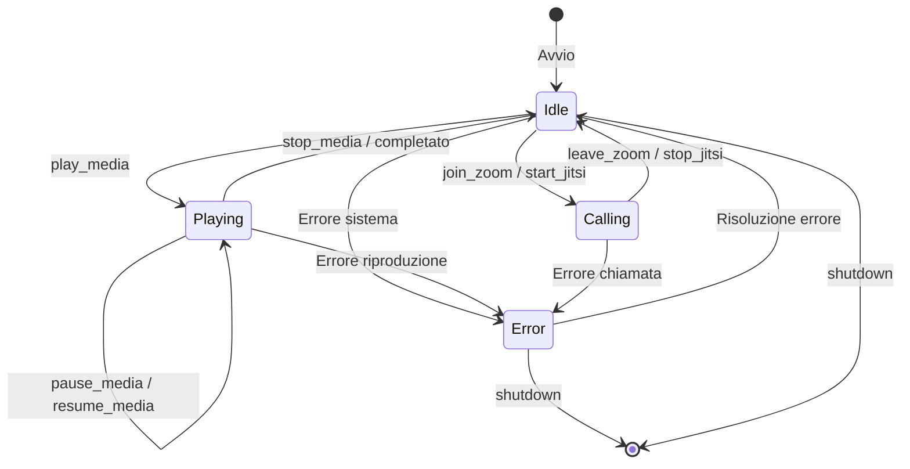
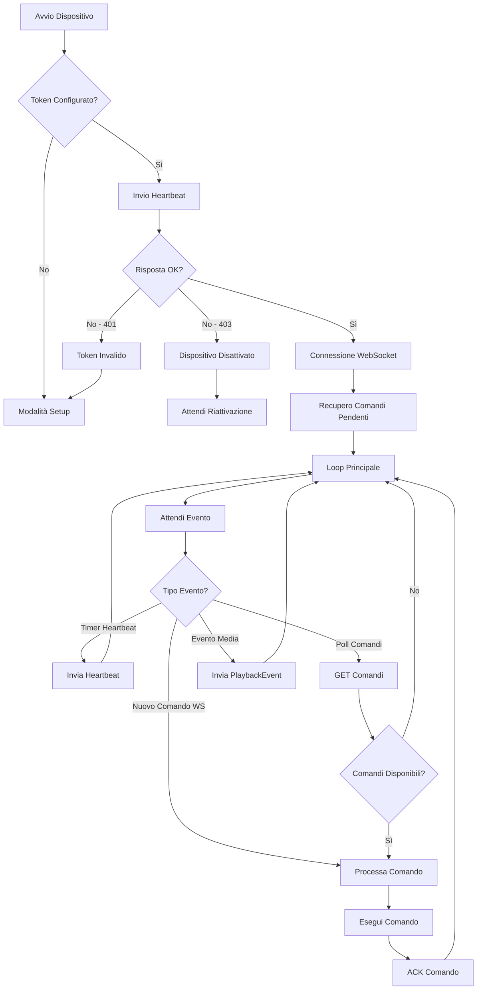
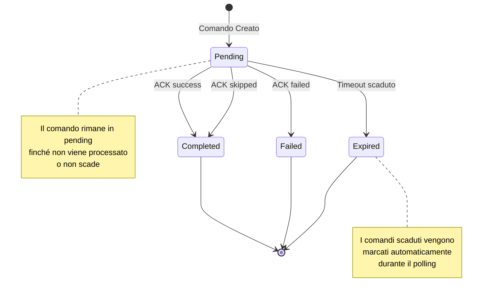
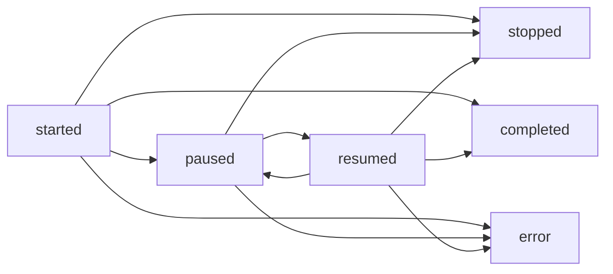
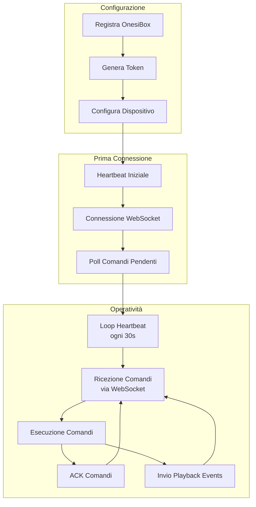

# OnesiBox - Guida Utente Completa

## Indice

1. [Introduzione](#introduzione)
2. [Architettura del Sistema](#architettura-del-sistema)
3. [Configurazione Iniziale](#configurazione-iniziale)
4. [Prima Connessione](#prima-connessione)
5. [Ciclo di Vita dell'Appliance](#ciclo-di-vita-dellappliance)
6. [Gestione dei Comandi](#gestione-dei-comandi)
7. [Monitoraggio e Heartbeat](#monitoraggio-e-heartbeat)
8. [Eventi di Riproduzione](#eventi-di-riproduzione)
9. [WebSocket e Comunicazione Real-Time](#websocket-e-comunicazione-real-time)
10. [Appendice A: Riferimento Completo API](#appendice-a-riferimento-completo-api)
11. [Appendice B: Tipi di Comandi](#appendice-b-tipi-di-comandi)
12. [Appendice C: Codici di Errore](#appendice-c-codici-di-errore)
13. [Appendice D: Enumerazioni](#appendice-d-enumerazioni)

---

## Introduzione

OnesiBox è un dispositivo intelligente progettato per l'assistenza domiciliare di persone anziane o con esigenze speciali. Il sistema permette ai caregiver di:

- Riprodurre contenuti multimediali (audio/video)
- Effettuare videochiamate (Zoom, Jitsi)
- Inviare messaggi vocali e testuali
- Monitorare lo stato del dispositivo in tempo reale
- Gestire il dispositivo da remoto (riavvio, spegnimento, VNC)

### Componenti del Sistema



---

## Architettura del Sistema

### Modello Dati



### Stati del Dispositivo



---

## Configurazione Iniziale

### Prerequisiti

1. **OnesiBox** registrato nel sistema con numero seriale univoco
2. **Token API** generato dall'amministratore
3. **Connessione di rete** stabile (WiFi o Ethernet)

### Processo di Registrazione

```mermaid
sequenceDiagram
    participant Admin as Amministratore
    participant Web as Pannello Web
    participant API as API Server
    participant Box as OnesiBox

    Admin->>Web: Crea nuova OnesiBox
    Web->>API: POST /admin/onesiboxes
    API-->>Web: OnesiBox creata (ID, Serial)

    Admin->>Web: Genera Token API
    Web->>API: Genera token Sanctum
    API-->>Web: Token (visibile una sola volta!)

    Admin->>Box: Configura token nel dispositivo
    Note over Box: Salva token in configurazione locale

    Box->>API: POST /heartbeat (con token)
    API-->>Box: 200 OK - Connessione stabilita
```

### Configurazione del Dispositivo

Il dispositivo OnesiBox deve essere configurato con i seguenti parametri:

| Parametro | Descrizione | Esempio |
|-----------|-------------|---------|
| `API_BASE_URL` | URL base dell'API | `https://api.onesiforo.it/api/v1` |
| `API_TOKEN` | Token Bearer per autenticazione | `1\|abc123...` |
| `WS_HOST` | Host WebSocket | `wss://ws.onesiforo.it` |
| `WS_APP_KEY` | Chiave applicazione Reverb | `app-key-here` |
| `HEARTBEAT_INTERVAL` | Intervallo heartbeat (secondi) | `30` |

### File di Configurazione Esempio

```json
{
  "api": {
    "base_url": "https://api.onesiforo.it/api/v1",
    "token": "YOUR_API_TOKEN_HERE"
  },
  "websocket": {
    "host": "wss://ws.onesiforo.it",
    "app_key": "your-app-key",
    "cluster": "mt1"
  },
  "settings": {
    "heartbeat_interval": 30,
    "command_poll_interval": 30,
    "auto_reconnect": true,
    "max_reconnect_attempts": 5
  }
}
```

---

## Prima Connessione

### Flusso di Prima Connessione

```mermaid
sequenceDiagram
    participant Box as OnesiBox
    participant API as API Server
    participant WS as WebSocket Server

    Note over Box: Avvio dispositivo

    Box->>API: POST /appliances/heartbeat
    Note right of Box: Headers: Authorization: Bearer {token}
    API->>API: Verifica token
    API->>API: Verifica is_active = true
    API->>API: Aggiorna last_seen_at
    API-->>Box: 200 OK {server_time, next_heartbeat: 30}

    Box->>API: GET /appliances/commands?status=pending
    API-->>Box: 200 OK {data: [...], meta: {total, pending}}

    Box->>WS: Connessione WebSocket
    WS->>WS: Autentica token
    Box->>WS: Subscribe: appliance.{id}
    WS-->>Box: Subscribed

    loop Ogni 30 secondi
        Box->>API: POST /appliances/heartbeat
        API-->>Box: 200 OK
    end
```

### Verifica della Connessione

Dopo la prima connessione, verificare:

1. **Heartbeat ricevuto**: Il campo `last_seen_at` viene aggiornato
2. **Stato online**: Il dispositivo appare come "Online" nel pannello
3. **Canale WebSocket**: Sottoscrizione al canale `appliance.{id}` attiva

### Codice di Esempio - Prima Connessione (Python)

```python
import requests
import json
from datetime import datetime

class OnesiBoxClient:
    def __init__(self, base_url: str, token: str):
        self.base_url = base_url
        self.token = token
        self.headers = {
            "Authorization": f"Bearer {token}",
            "Content-Type": "application/json",
            "Accept": "application/json"
        }

    def send_heartbeat(self, status: str = "idle") -> dict:
        """Invia heartbeat al server."""
        response = requests.post(
            f"{self.base_url}/appliances/heartbeat",
            headers=self.headers,
            json={"status": status}
        )
        response.raise_for_status()
        return response.json()

    def get_pending_commands(self, limit: int = 10) -> dict:
        """Recupera i comandi pendenti."""
        response = requests.get(
            f"{self.base_url}/appliances/commands",
            headers=self.headers,
            params={"status": "pending", "limit": limit}
        )
        response.raise_for_status()
        return response.json()

# Utilizzo
client = OnesiBoxClient(
    base_url="https://api.onesiforo.it/api/v1",
    token="YOUR_TOKEN"
)

# Prima connessione
heartbeat = client.send_heartbeat(status="idle")
print(f"Server time: {heartbeat['data']['server_time']}")
print(f"Next heartbeat in: {heartbeat['data']['next_heartbeat']}s")

# Recupera comandi pendenti
commands = client.get_pending_commands()
print(f"Comandi pendenti: {commands['meta']['pending']}")
```

---

## Ciclo di Vita dell'Appliance

### Diagramma del Ciclo di Vita



### Stati di Connessione

| Stato | Descrizione | Azione Consigliata |
|-------|-------------|-------------------|
| **Online** | `last_seen_at` < 5 minuti | Normale operatività |
| **Offline** | `last_seen_at` >= 5 minuti | Verificare connettività |
| **Mai visto** | `last_seen_at` = null | Configurazione non completata |
| **Disattivato** | `is_active` = false | Contattare amministratore |

---

## Gestione dei Comandi

### Ciclo di Vita del Comando



### Flusso di Esecuzione Comando

```mermaid
sequenceDiagram
    participant Admin as Caregiver
    participant API as API Server
    participant WS as WebSocket
    participant Box as OnesiBox

    Admin->>API: Crea comando (es. play_media)
    API->>API: Salva comando (status=pending)
    API->>WS: Broadcast NewCommandAvailable
    API-->>Admin: 200 OK

    WS-->>Box: Event: NewCommand
    Note over Box: {uuid, type, priority, expires_at}

    Box->>API: GET /appliances/commands
    API-->>Box: Lista comandi ordinati per priorità

    Box->>Box: Esegue comando

    alt Successo
        Box->>API: POST /commands/{uuid}/ack
        Note right of Box: {status: "success", executed_at}
        API-->>Box: 200 OK {acknowledged: true}
    else Errore
        Box->>API: POST /commands/{uuid}/ack
        Note right of Box: {status: "failed", error_code, error_message}
        API-->>Box: 200 OK {acknowledged: true}
    else Comando Saltato
        Box->>API: POST /commands/{uuid}/ack
        Note right of Box: {status: "skipped", executed_at}
        API-->>Box: 200 OK {acknowledged: true}
    end
```

### Priorità dei Comandi

I comandi vengono ordinati per:
1. **Priorità** (1 = massima, 5 = minima)
2. **Data di creazione** (FIFO per stessa priorità)

| Priorità | Uso Tipico |
|----------|-----------|
| 1 | Emergenze, shutdown, reboot |
| 2 | Comandi VNC, configurazione |
| 3 | Videochiamate (default) |
| 4 | Riproduzione media (default) |
| 5 | Messaggi, TTS |

### Tempi di Scadenza

| Tipo Comando | Scadenza | Note |
|--------------|----------|------|
| `reboot`, `shutdown` | 5 minuti | Comandi urgenti |
| `start_vnc`, `stop_vnc` | 5 minuti | Accesso remoto |
| `update_config` | 24 ore | Configurazioni possono attendere |
| Tutti gli altri | 60 minuti | Default |

---

## Monitoraggio e Heartbeat

### Struttura Heartbeat

```mermaid
sequenceDiagram
    participant Box as OnesiBox
    participant API as API Server

    Box->>API: POST /appliances/heartbeat
    Note right of Box: Request Body

    rect rgb(240, 240, 240)
        Note over Box,API: {<br/>  "status": "playing",<br/>  "cpu_usage": 45,<br/>  "memory_usage": 62,<br/>  "disk_usage": 30,<br/>  "temperature": 52.5,<br/>  "uptime": 86400,<br/>  "current_media": {<br/>    "url": "https://...",<br/>    "type": "video",<br/>    "position": 120,<br/>    "duration": 300<br/>  }<br/>}
    end

    API-->>Box: Response

    rect rgb(240, 255, 240)
        Note over Box,API: {<br/>  "data": {<br/>    "server_time": "2026-01-22T10:30:00Z",<br/>    "next_heartbeat": 30<br/>  }<br/>}
    end
```

### Parametri del Heartbeat

| Campo | Tipo | Obbligatorio | Descrizione |
|-------|------|--------------|-------------|
| `status` | string | **Sì** | Stato corrente (`idle`, `playing`, `calling`, `error`) |
| `cpu_usage` | integer | No | Utilizzo CPU (0-100%) |
| `memory_usage` | integer | No | Utilizzo memoria (0-100%) |
| `disk_usage` | integer | No | Utilizzo disco (0-100%) |
| `temperature` | float | No | Temperatura CPU (0-150°C) |
| `uptime` | integer | No | Secondi dall'avvio |
| `current_media` | object | No | Media in riproduzione |
| `current_media.url` | string | Se `current_media` | URL del media |
| `current_media.type` | string | Se `current_media` | `audio` o `video` |
| `current_media.position` | integer | No | Posizione in secondi |
| `current_media.duration` | integer | No | Durata totale in secondi |

---

## Eventi di Riproduzione

### Tipi di Eventi



### Flusso degli Eventi

```mermaid
sequenceDiagram
    participant Box as OnesiBox
    participant API as API Server

    Note over Box: Riceve comando play_media

    Box->>API: POST /appliances/playback
    Note right of Box: {event: "started", media_url, media_type}
    API-->>Box: 200 OK {logged: true, event_id: 1}

    Note over Box: Utente mette in pausa

    Box->>API: POST /appliances/playback
    Note right of Box: {event: "paused", position: 60}
    API-->>Box: 200 OK

    Note over Box: Utente riprende

    Box->>API: POST /appliances/playback
    Note right of Box: {event: "resumed", position: 60}
    API-->>Box: 200 OK

    Note over Box: Riproduzione completata

    Box->>API: POST /appliances/playback
    Note right of Box: {event: "completed", duration: 180}
    API-->>Box: 200 OK
```

---

## WebSocket e Comunicazione Real-Time

### Architettura WebSocket

```mermaid
graph TB
    subgraph "Server"
        REVERB[Laravel Reverb]
        REDIS[(Redis)]
    end

    subgraph "Canali Privati"
        CH1[appliance.{id}]
        CH2[onesibox.{id}]
    end

    subgraph "Client"
        BOX[OnesiBox Device]
        WEB[Web Dashboard]
    end

    REVERB --> CH1
    REVERB --> CH2
    REDIS --> REVERB

    BOX <--> CH1
    WEB <--> CH2
```

### Canali Disponibili

| Canale | Sottoscrittori | Eventi | Autorizzazione |
|--------|---------------|--------|----------------|
| `appliance.{id}` | OnesiBox | `NewCommand` | Token appartiene a OnesiBox con stesso ID |
| `onesibox.{id}` | Dashboard Web | `StatusUpdated` | User è caregiver di OnesiBox |

### Evento: NewCommand

Ricevuto quando viene creato un nuovo comando per il dispositivo.

```json
{
  "event": "NewCommand",
  "channel": "private-appliance.123",
  "data": {
    "uuid": "550e8400-e29b-41d4-a716-446655440000",
    "type": "play_media",
    "priority": 3,
    "expires_at": "2026-01-22T11:30:00.000000Z"
  }
}
```

### Evento: StatusUpdated

Ricevuto dalla dashboard quando lo stato del dispositivo cambia.

```json
{
  "event": "StatusUpdated",
  "channel": "private-onesibox.123",
  "data": {
    "id": 123,
    "status": "playing",
    "is_online": true,
    "last_seen_at": "2026-01-22T10:30:00.000000Z"
  }
}
```

### Connessione WebSocket (JavaScript)

```javascript
import Echo from 'laravel-echo';
import Pusher from 'pusher-js';

window.Pusher = Pusher;

const echo = new Echo({
    broadcaster: 'reverb',
    key: 'your-app-key',
    wsHost: 'ws.onesiforo.it',
    wsPort: 443,
    wssPort: 443,
    forceTLS: true,
    enabledTransports: ['ws', 'wss'],
    authEndpoint: '/broadcasting/auth',
    auth: {
        headers: {
            Authorization: `Bearer ${token}`
        }
    }
});

// Sottoscrizione canale appliance
echo.private(`appliance.${deviceId}`)
    .listen('.NewCommand', (data) => {
        console.log('Nuovo comando:', data);
        // Recupera e processa il comando
        fetchAndProcessCommand(data.uuid);
    });
```

---

## Appendice A: Riferimento Completo API

### Autenticazione

Tutte le richieste API devono includere l'header di autenticazione:

```
Authorization: Bearer {token}
```

Il token viene generato dal pannello amministrativo e ha validità di 365 giorni.

### Base URL

```
https://api.onesiforo.it/api/v1
```

---

### 1. Heartbeat

#### `POST /appliances/heartbeat`

Registra un heartbeat dal dispositivo. Aggiorna `last_seen_at` e lo stato del dispositivo.

**Request Headers:**
```
Authorization: Bearer {token}
Content-Type: application/json
Accept: application/json
```

**Request Body:**

| Campo | Tipo | Obbligatorio | Validazione | Descrizione |
|-------|------|--------------|-------------|-------------|
| `status` | string | **Sì** | `idle`, `playing`, `calling`, `error` | Stato corrente del dispositivo |
| `cpu_usage` | integer | No | 0-100 | Percentuale utilizzo CPU |
| `memory_usage` | integer | No | 0-100 | Percentuale utilizzo memoria |
| `disk_usage` | integer | No | 0-100 | Percentuale utilizzo disco |
| `temperature` | float | No | 0-150 | Temperatura in °C |
| `uptime` | integer | No | >= 0 | Secondi dall'avvio |
| `current_media` | object | No | - | Media attualmente in riproduzione |
| `current_media.url` | string | Se `current_media` | URL valido | URL del media |
| `current_media.type` | string | Se `current_media` | `audio`, `video` | Tipo di media |
| `current_media.position` | integer | No | >= 0 | Posizione in secondi |
| `current_media.duration` | integer | No | >= 0 | Durata in secondi |

**Esempio Request:**
```json
{
  "status": "playing",
  "cpu_usage": 45,
  "memory_usage": 62,
  "disk_usage": 30,
  "temperature": 52.5,
  "uptime": 86400,
  "current_media": {
    "url": "https://media.example.com/video.mp4",
    "type": "video",
    "position": 120,
    "duration": 300
  }
}
```

**Response 200 OK:**
```json
{
  "data": {
    "server_time": "2026-01-22T10:30:00+00:00",
    "next_heartbeat": 30
  }
}
```

**Response 401 Unauthorized:**
```json
{
  "message": "Unauthenticated."
}
```

**Response 403 Forbidden:**
```json
{
  "message": "Appliance disattivata.",
  "error_code": "E003"
}
```

**Response 422 Unprocessable Entity:**
```json
{
  "message": "The status field is required.",
  "errors": {
    "status": ["Lo stato dell'appliance è obbligatorio."]
  }
}
```

---

### 2. Recupero Comandi

#### `GET /appliances/commands`

Recupera i comandi per il dispositivo autenticato.

**Query Parameters:**

| Parametro | Tipo | Default | Validazione | Descrizione |
|-----------|------|---------|-------------|-------------|
| `status` | string | `pending` | `pending`, `all` | Filtra per stato |
| `limit` | integer | 10 | 1-50 | Numero massimo di comandi |

**Esempio Request:**
```
GET /api/v1/appliances/commands?status=pending&limit=10
Authorization: Bearer {token}
```

**Response 200 OK:**
```json
{
  "data": [
    {
      "id": "550e8400-e29b-41d4-a716-446655440000",
      "type": "play_media",
      "payload": {
        "url": "https://media.example.com/video.mp4",
        "type": "video"
      },
      "priority": 3,
      "status": "pending",
      "created_at": "2026-01-22T10:00:00+00:00",
      "expires_at": "2026-01-22T11:00:00+00:00"
    },
    {
      "id": "660e8400-e29b-41d4-a716-446655440001",
      "type": "set_volume",
      "payload": {
        "level": 75
      },
      "priority": 4,
      "status": "pending",
      "created_at": "2026-01-22T10:05:00+00:00",
      "expires_at": "2026-01-22T11:05:00+00:00"
    }
  ],
  "meta": {
    "total": 15,
    "pending": 2
  }
}
```

**Note:**
- I comandi sono ordinati per priorità (1=più alta) e poi per data di creazione
- I comandi scaduti vengono automaticamente marcati come `expired` durante questa chiamata

---

### 3. Acknowledgment Comando

#### `POST /commands/{uuid}/ack`

Conferma l'esecuzione di un comando. Operazione idempotente.

**URL Parameters:**

| Parametro | Tipo | Descrizione |
|-----------|------|-------------|
| `uuid` | string | UUID del comando |

**Request Body:**

| Campo | Tipo | Obbligatorio | Validazione | Descrizione |
|-------|------|--------------|-------------|-------------|
| `status` | string | **Sì** | `success`, `failed`, `skipped` | Esito esecuzione |
| `error_code` | string | No | max 10 caratteri | Codice errore (se failed) |
| `error_message` | string | No | max 1000 caratteri | Messaggio errore (se failed) |
| `executed_at` | string | **Sì** | ISO 8601 datetime | Timestamp esecuzione |

**Esempio Request - Successo:**
```json
{
  "status": "success",
  "executed_at": "2026-01-22T10:30:15+00:00"
}
```

**Esempio Request - Errore:**
```json
{
  "status": "failed",
  "error_code": "MEDIA_ERR",
  "error_message": "Impossibile riprodurre il file: formato non supportato",
  "executed_at": "2026-01-22T10:30:15+00:00"
}
```

**Esempio Request - Saltato:**
```json
{
  "status": "skipped",
  "executed_at": "2026-01-22T10:30:15+00:00"
}
```

**Response 200 OK:**
```json
{
  "data": {
    "acknowledged": true,
    "command_id": "550e8400-e29b-41d4-a716-446655440000",
    "status": "completed"
  }
}
```

**Response 403 Forbidden:**
```json
{
  "message": "Comando non autorizzato per questa appliance.",
  "error_code": "E003"
}
```

**Response 404 Not Found:**
```json
{
  "message": "Comando non trovato.",
  "error_code": "E002"
}
```

**Note:**
- L'operazione è **idempotente**: ripetere l'ACK su un comando già processato restituisce successo
- Lo stato `skipped` viene trattato come `completed` (nessuna azione intrapresa)

---

### 4. Eventi di Riproduzione

#### `POST /appliances/playback`

Registra un evento di riproduzione media.

**Request Body:**

| Campo | Tipo | Obbligatorio | Validazione | Descrizione |
|-------|------|--------------|-------------|-------------|
| `event` | string | **Sì** | `started`, `paused`, `resumed`, `stopped`, `completed`, `error` | Tipo evento |
| `media_url` | string | **Sì** | URL valido, max 2048 | URL del media |
| `media_type` | string | **Sì** | `audio`, `video` | Tipo media |
| `position` | integer | No | >= 0 | Posizione corrente in secondi |
| `duration` | integer | No | >= 0 | Durata totale in secondi |
| `error_message` | string | No | max 1000 | Messaggio errore (se event=error) |

**Esempio Request - Avvio:**
```json
{
  "event": "started",
  "media_url": "https://media.example.com/video.mp4",
  "media_type": "video",
  "duration": 300
}
```

**Esempio Request - Pausa:**
```json
{
  "event": "paused",
  "media_url": "https://media.example.com/video.mp4",
  "media_type": "video",
  "position": 120,
  "duration": 300
}
```

**Esempio Request - Errore:**
```json
{
  "event": "error",
  "media_url": "https://media.example.com/video.mp4",
  "media_type": "video",
  "position": 45,
  "error_message": "Network error: connection lost"
}
```

**Response 200 OK:**
```json
{
  "data": {
    "logged": true,
    "event_id": 12345
  }
}
```

---

## Appendice B: Tipi di Comandi

### Comandi Media

#### `play_media` - Riproduci Media

Avvia la riproduzione di un contenuto audio o video.

**Payload:**
```json
{
  "url": "https://media.example.com/content.mp4",
  "type": "video",
  "title": "Messaggio dalla famiglia",
  "loop": false,
  "volume": 80
}
```

| Campo | Tipo | Obbligatorio | Descrizione |
|-------|------|--------------|-------------|
| `url` | string | **Sì** | URL del media |
| `type` | string | **Sì** | `audio` o `video` |
| `title` | string | No | Titolo da mostrare |
| `loop` | boolean | No | Ripeti in loop (default: false) |
| `volume` | integer | No | Volume iniziale 0-100 |

**Scadenza:** 60 minuti

---

#### `stop_media` - Ferma Media

Interrompe la riproduzione corrente.

**Payload:** `null` o `{}`

**Scadenza:** 60 minuti

---

#### `pause_media` - Pausa Media

Mette in pausa la riproduzione corrente.

**Payload:** `null` o `{}`

**Scadenza:** 60 minuti

---

#### `resume_media` - Riprendi Media

Riprende la riproduzione dopo una pausa.

**Payload:** `null` o `{}`

**Scadenza:** 60 minuti

---

#### `set_volume` - Imposta Volume

Regola il volume del sistema.

**Payload:**
```json
{
  "level": 75
}
```

| Campo | Tipo | Obbligatorio | Descrizione |
|-------|------|--------------|-------------|
| `level` | integer | **Sì** | Livello volume 0-100 |

**Scadenza:** 60 minuti

---

### Comandi Videochiamata

#### `join_zoom` - Entra in Zoom

Avvia una riunione Zoom.

**Payload:**
```json
{
  "meeting_id": "123456789",
  "password": "abc123",
  "display_name": "Nonna Maria"
}
```

| Campo | Tipo | Obbligatorio | Descrizione |
|-------|------|--------------|-------------|
| `meeting_id` | string | **Sì** | ID riunione Zoom |
| `password` | string | No | Password riunione |
| `display_name` | string | No | Nome visualizzato |

**Scadenza:** 60 minuti

---

#### `leave_zoom` - Esci da Zoom

Termina la riunione Zoom corrente.

**Payload:** `null` o `{}`

**Scadenza:** 60 minuti

---

#### `start_jitsi` - Avvia Jitsi

Avvia una videochiamata Jitsi.

**Payload:**
```json
{
  "room": "famiglia-rossi-call",
  "server": "meet.jit.si",
  "display_name": "Nonna Maria",
  "audio_only": false
}
```

| Campo | Tipo | Obbligatorio | Descrizione |
|-------|------|--------------|-------------|
| `room` | string | **Sì** | Nome stanza |
| `server` | string | No | Server Jitsi (default: meet.jit.si) |
| `display_name` | string | No | Nome visualizzato |
| `audio_only` | boolean | No | Solo audio (default: false) |

**Scadenza:** 60 minuti

---

#### `stop_jitsi` - Termina Jitsi

Termina la videochiamata Jitsi corrente.

**Payload:** `null` o `{}`

**Scadenza:** 60 minuti

---

### Comandi Comunicazione

#### `speak_text` - Sintesi Vocale

Legge un testo ad alta voce usando TTS.

**Payload:**
```json
{
  "text": "Ciao nonna! Ti vogliamo bene!",
  "language": "it-IT",
  "speed": 0.9,
  "voice": "female"
}
```

| Campo | Tipo | Obbligatorio | Descrizione |
|-------|------|--------------|-------------|
| `text` | string | **Sì** | Testo da leggere |
| `language` | string | No | Codice lingua (default: it-IT) |
| `speed` | float | No | Velocità 0.5-2.0 (default: 1.0) |
| `voice` | string | No | `male` o `female` |

**Scadenza:** 60 minuti

---

#### `show_message` - Mostra Messaggio

Mostra un messaggio sullo schermo.

**Payload:**
```json
{
  "title": "Promemoria",
  "body": "Ricordati di prendere le medicine alle 14:00",
  "duration": 30,
  "type": "info",
  "sound": true
}
```

| Campo | Tipo | Obbligatorio | Descrizione |
|-------|------|--------------|-------------|
| `title` | string | No | Titolo messaggio |
| `body` | string | **Sì** | Corpo del messaggio |
| `duration` | integer | No | Durata visualizzazione in secondi (0 = permanente) |
| `type` | string | No | `info`, `warning`, `alert` |
| `sound` | boolean | No | Riproduci suono notifica |

**Scadenza:** 60 minuti

---

### Comandi Sistema

#### `reboot` - Riavvia

Riavvia il dispositivo.

**Payload:**
```json
{
  "delay": 5,
  "reason": "Aggiornamento sistema"
}
```

| Campo | Tipo | Obbligatorio | Descrizione |
|-------|------|--------------|-------------|
| `delay` | integer | No | Ritardo in secondi (default: 0) |
| `reason` | string | No | Motivo del riavvio |

**Scadenza:** 5 minuti (urgente)

---

#### `shutdown` - Spegni

Spegne il dispositivo.

**Payload:**
```json
{
  "delay": 10,
  "reason": "Richiesto da amministratore"
}
```

| Campo | Tipo | Obbligatorio | Descrizione |
|-------|------|--------------|-------------|
| `delay` | integer | No | Ritardo in secondi (default: 0) |
| `reason` | string | No | Motivo dello spegnimento |

**Scadenza:** 5 minuti (urgente)

---

### Comandi Accesso Remoto

#### `start_vnc` - Avvia VNC

Avvia il server VNC per accesso remoto.

**Payload:**
```json
{
  "password": "temp123",
  "port": 5900,
  "view_only": false
}
```

| Campo | Tipo | Obbligatorio | Descrizione |
|-------|------|--------------|-------------|
| `password` | string | No | Password sessione VNC |
| `port` | integer | No | Porta VNC (default: 5900) |
| `view_only` | boolean | No | Solo visualizzazione |

**Scadenza:** 5 minuti (urgente)

---

#### `stop_vnc` - Termina VNC

Termina il server VNC.

**Payload:** `null` o `{}`

**Scadenza:** 5 minuti (urgente)

---

### Comandi Configurazione

#### `update_config` - Aggiorna Configurazione

Aggiorna la configurazione del dispositivo.

**Payload:**
```json
{
  "settings": {
    "screen_brightness": 80,
    "volume_default": 70,
    "screen_timeout": 300,
    "language": "it-IT"
  }
}
```

| Campo | Tipo | Obbligatorio | Descrizione |
|-------|------|--------------|-------------|
| `settings` | object | **Sì** | Oggetto con le impostazioni da aggiornare |

**Scadenza:** 24 ore

---

## Appendice C: Codici di Errore

### Codici di Errore API

| Codice | HTTP Status | Descrizione | Azione Consigliata |
|--------|-------------|-------------|-------------------|
| `E002` | 404 | Comando non trovato | Verificare UUID comando |
| `E003` | 403 | Non autorizzato / Dispositivo disattivato | Verificare token e stato dispositivo |

### Codici di Errore Comando

Codici utilizzabili nel campo `error_code` dell'ACK:

| Codice | Descrizione |
|--------|-------------|
| `MEDIA_ERR` | Errore riproduzione media |
| `NET_ERR` | Errore di rete |
| `CALL_ERR` | Errore videochiamata |
| `SYS_ERR` | Errore di sistema |
| `CFG_ERR` | Errore configurazione |
| `VNC_ERR` | Errore VNC |
| `TTS_ERR` | Errore sintesi vocale |
| `TIMEOUT` | Timeout esecuzione |
| `CANCELLED` | Comando annullato |
| `UNSUPPORTED` | Comando non supportato |

---

## Appendice D: Enumerazioni

### OnesiBoxStatus - Stati del Dispositivo

| Valore | Descrizione | Icona | Colore |
|--------|-------------|-------|--------|
| `idle` | Inattivo - dispositivo in standby | pause-circle | Grigio |
| `playing` | In riproduzione - media attivo | play-circle | Verde |
| `calling` | In chiamata - videochiamata attiva | phone | Blu |
| `error` | Errore - problema rilevato | exclamation-triangle | Rosso |

### CommandType - Tipi di Comando

| Valore | Categoria | Descrizione | Scadenza |
|--------|-----------|-------------|----------|
| `play_media` | Media | Riproduci media | 60 min |
| `stop_media` | Media | Ferma media | 60 min |
| `pause_media` | Media | Pausa media | 60 min |
| `resume_media` | Media | Riprendi media | 60 min |
| `set_volume` | Media | Imposta volume | 60 min |
| `join_zoom` | Videochiamata | Entra in Zoom | 60 min |
| `leave_zoom` | Videochiamata | Esci da Zoom | 60 min |
| `start_jitsi` | Videochiamata | Avvia Jitsi | 60 min |
| `stop_jitsi` | Videochiamata | Termina Jitsi | 60 min |
| `speak_text` | Comunicazione | Sintesi vocale | 60 min |
| `show_message` | Comunicazione | Mostra messaggio | 60 min |
| `reboot` | Sistema | Riavvia | 5 min |
| `shutdown` | Sistema | Spegni | 5 min |
| `start_vnc` | Accesso remoto | Avvia VNC | 5 min |
| `stop_vnc` | Accesso remoto | Termina VNC | 5 min |
| `update_config` | Configurazione | Aggiorna config | 24 ore |

### CommandStatus - Stati del Comando

| Valore | Descrizione | Processabile | Processato |
|--------|-------------|--------------|------------|
| `pending` | In attesa di esecuzione | Sì | No |
| `completed` | Eseguito con successo | No | Sì |
| `failed` | Esecuzione fallita | No | Sì |
| `expired` | Scaduto prima dell'esecuzione | No | No |

### PlaybackEventType - Eventi di Riproduzione

| Valore | Descrizione | Icona | Colore |
|--------|-------------|-------|--------|
| `started` | Riproduzione avviata | play | Verde |
| `paused` | Riproduzione in pausa | pause | Giallo |
| `resumed` | Riproduzione ripresa | play-circle | Verde |
| `stopped` | Riproduzione fermata | stop | Grigio |
| `completed` | Riproduzione completata | check-circle | Blu |
| `error` | Errore riproduzione | exclamation-triangle | Rosso |

### OnesiBoxPermission - Livelli di Permesso

| Valore | Descrizione | Può Visualizzare | Può Comandare |
|--------|-------------|-----------------|---------------|
| `full` | Accesso completo | Sì | Sì |
| `read-only` | Solo lettura | Sì | No |

---

## Diagramma Riepilogativo



---

## Versione del Documento

| Versione | Data | Autore | Note |
|----------|------|--------|------|
| 1.0 | 2026-01-22 | Sistema | Versione iniziale completa |

---

*Documento generato automaticamente dalla codebase Onesiforo.*
