# Progetto Onesiforo & OnesiBox

## Documento di Progetto Completo

**Versione:** 1.0
**Data:** Gennaio 2026
**Stato:** Approvato
**Repository:**
- Server: `onesiforo`
- Client: `onesi-box`

---

## Indice

1. [Introduzione](#1-introduzione)
2. [Vision e Obiettivi](#2-vision-e-obiettivi)
3. [Architettura del Sistema](#3-architettura-del-sistema)
4. [Componenti del Sistema](#4-componenti-del-sistema)
5. [Modello Dati](#5-modello-dati)
6. [Pattern di Comunicazione](#6-pattern-di-comunicazione)
7. [Specifica API](#7-specifica-api)
8. [Sicurezza](#8-sicurezza)
9. [Requisiti](#9-requisiti)
10. [Stack Tecnologico](#10-stack-tecnologico)
11. [Deployment e Infrastruttura](#11-deployment-e-infrastruttura)
12. [Roadmap](#12-roadmap)
13. [Glossario](#13-glossario)
14. [Appendici](#14-appendici)

---

## 1. Introduzione

### 1.1 Scopo del Documento

Questo documento fornisce una visione completa e integrata del **Progetto Onesiforo**, comprendente sia la piattaforma web centrale (**Onesiforo**) che il client embedded (**OnesiBox**). Il documento descrive l'architettura, i requisiti, le specifiche tecniche e la roadmap di sviluppo.

### 1.2 Il Nome "Onesiforo"

Il nome deriva da **Onesiforo**, cristiano del I secolo che si distinse per la premura e l'assistenza mostrata verso l'apostolo Paolo durante la sua prigionia a Roma (2 Timoteo 1:16-17). Questo riflette la missione del progetto: portare assistenza e compagnia a chi ne ha bisogno.

### 1.3 Contesto del Progetto

Il progetto nasce dall'esigenza di assistere **persone anziane con mobilità ridotta** che non possono partecipare fisicamente alle adunanze religiose o mantenere contatti regolari con familiari e comunità. La soluzione tecnologica permette ai **caregiver** (familiari o volontari) di inviare contenuti multimediali e gestire videochiamate da remoto, senza richiedere alcuna interazione da parte del beneficiario.

### 1.4 Stakeholder

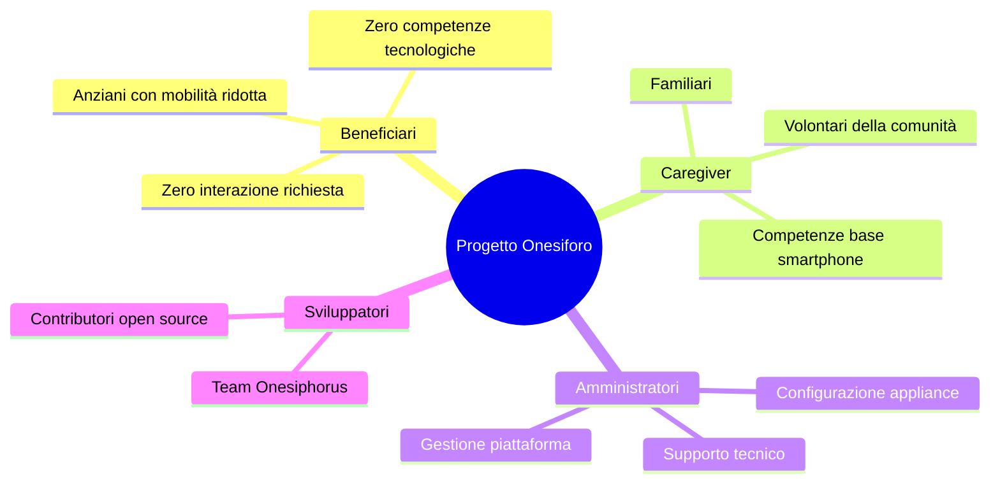

---

## 2. Vision e Obiettivi

### 2.1 Vision

> *"Portare compagnia spirituale e connessione umana a chi, per limiti fisici, non può raggiungerla autonomamente."*

### 2.2 Obiettivi Strategici

| Obiettivo | Descrizione | Indicatore di Successo |
|-----------|-------------|------------------------|
| **Accessibilità** | Zero interazione richiesta dal beneficiario | 100% operazioni remote |
| **Affidabilità** | Sistema funzionante 24/7 | Uptime > 99.5% |
| **Semplicità** | Interfaccia intuitiva per caregiver | < 3 click per azione |
| **Sicurezza** | Protezione dati e comunicazioni | Zero breach |
| **Scalabilità** | Supporto per crescita utenti | 100+ appliance simultanee |

### 2.3 Casi d'Uso Primari

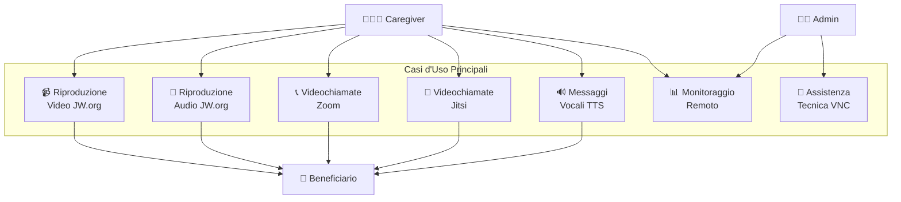

---

## 3. Architettura del Sistema

### 3.1 Panoramica Architetturale

Il sistema adotta un'architettura **client-server distribuita** con comunicazione bidirezionale real-time.

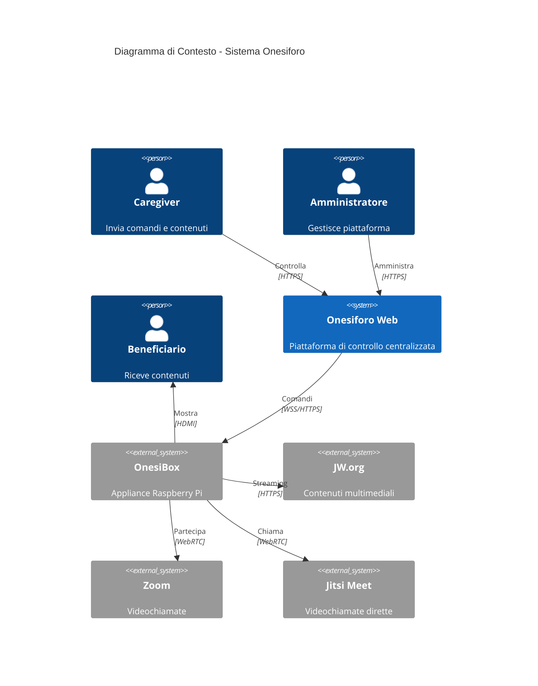

### 3.2 Architettura a Livelli

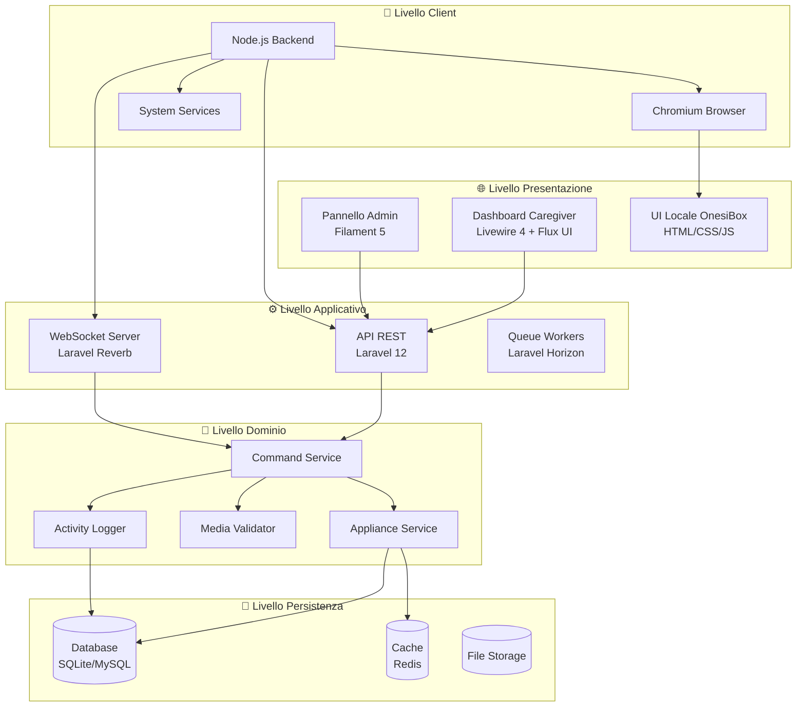

### 3.3 Architettura di Rete

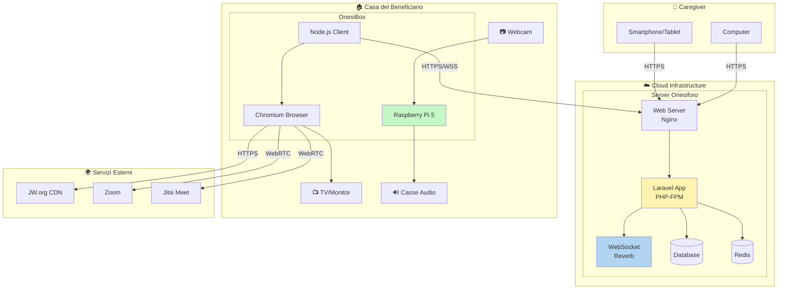

---

## 4. Componenti del Sistema

### 4.1 Onesiforo (Server Web)

#### 4.1.1 Descrizione

**Onesiforo** è la piattaforma web centrale che funge da hub di controllo per tutte le appliance OnesiBox. È sviluppata con **Laravel 12** e fornisce:

- Dashboard per caregiver con stato real-time delle appliance
- Pannello amministrativo completo (Filament 5)
- API REST per comunicazione con le appliance
- WebSocket server per notifiche real-time
- Sistema di autenticazione robusto (Fortify + 2FA)

#### 4.1.2 Struttura dei Moduli

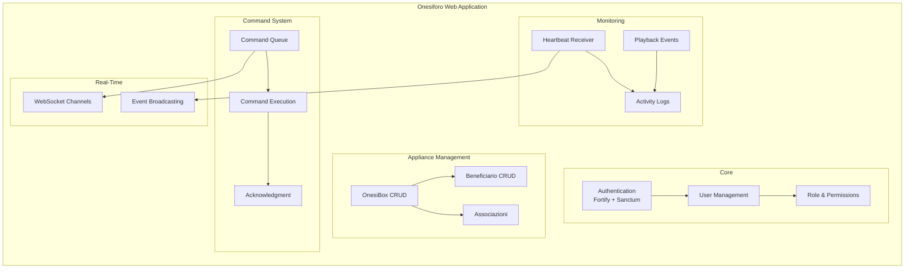

#### 4.1.3 Tecnologie Server

| Componente | Tecnologia | Versione |
|------------|------------|----------|
| Framework | Laravel | 12.x |
| PHP | PHP | 8.4 |
| Admin Panel | Filament | 5.x |
| Frontend | Livewire + Flux UI | 4.x / 2.x |
| WebSocket | Laravel Reverb | 1.x |
| Auth | Laravel Fortify + Sanctum | 1.x / 4.x |
| Testing | Pest | 4.x |
| Database | SQLite (dev) / MySQL (prod) | - |
| Cache | Redis | - |
| Code Style | Laravel Pint | 1.x |
| Static Analysis | Larastan | 3.x |

### 4.2 OnesiBox (Client Raspberry Pi)

#### 4.2.1 Descrizione

**OnesiBox** è l'appliance hardware installata presso il beneficiario. È basata su **Raspberry Pi 5** e esegue un'applicazione **Node.js** che:

- Riceve comandi dal server Onesiforo
- Controlla un browser Chromium in modalità kiosk
- Riproduce contenuti multimediali
- Gestisce videochiamate automaticamente
- Monitora lo stato del sistema
- Si auto-ripara in caso di errori

#### 4.2.2 Architettura Client

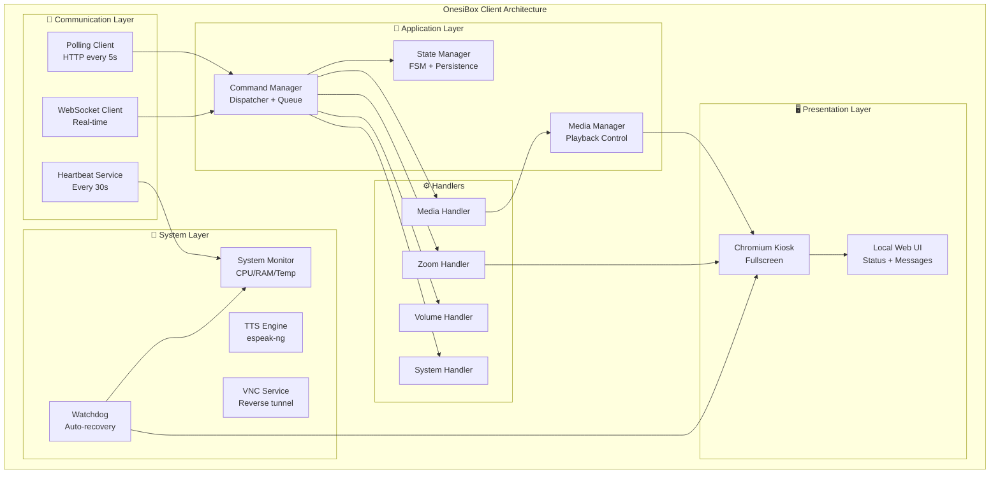

#### 4.2.3 Tecnologie Client

| Componente | Tecnologia | Versione |
|------------|------------|----------|
| Runtime | Node.js | 20 LTS |
| HTTP Client | axios | ^1.x |
| Logging | winston | ^3.x |
| System Info | systeminformation | ^5.x |
| Browser | Chromium | 120+ |
| TTS | espeak-ng | - |
| OS | Raspberry Pi OS Lite 64-bit | Bookworm |
| Testing | Jest | ^30.x |

#### 4.2.4 Hardware Supportato

| Componente | Specifica | Note |
|------------|-----------|------|
| **CPU** | Raspberry Pi 5 (4GB/8GB RAM) | Pi 4 supportato come legacy |
| **Storage** | microSD 32GB classe A2 | Consigliata A2 per velocità |
| **Display** | Qualsiasi TV/Monitor HDMI | Risoluzione auto-detect |
| **Audio** | Casse USB o audio HDMI | USB consigliato |
| **Webcam** | USB compatibile V4L2 | Es. Logitech C920 |
| **Rete** | Ethernet o WiFi/LTE | LTE via dongle USB |

---

## 5. Modello Dati

### 5.1 Diagramma Entity-Relationship

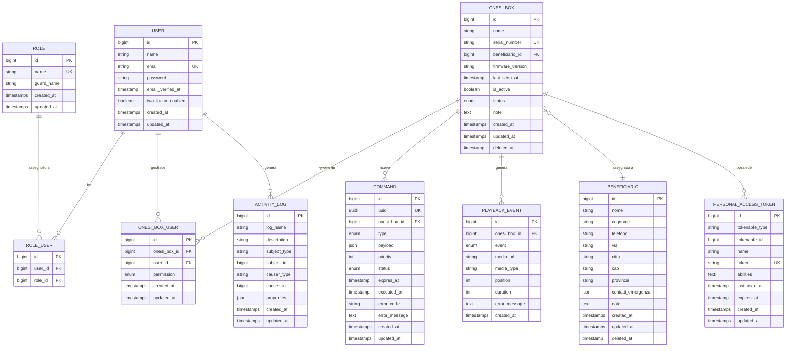

### 5.2 Enumerazioni

#### OnesiBoxStatus

| Valore | Descrizione | Icona | Colore |
|--------|-------------|-------|--------|
| `idle` | Dispositivo inattivo/standby | ⏸️ | Grigio |
| `playing` | Riproduzione media in corso | ▶️ | Verde |
| `calling` | Videochiamata attiva | 📞 | Blu |
| `error` | Errore rilevato | ⚠️ | Rosso |

#### CommandType

| Categoria | Tipo | Descrizione | Scadenza |
|-----------|------|-------------|----------|
| **Media** | `play_media` | Riproduce audio/video | 60 min |
| **Media** | `stop_media` | Interrompe riproduzione | 60 min |
| **Media** | `pause_media` | Mette in pausa | 60 min |
| **Media** | `resume_media` | Riprende riproduzione | 60 min |
| **Media** | `set_volume` | Regola volume 0-100 | 60 min |
| **Videochiamata** | `join_zoom` | Entra in riunione Zoom | 60 min |
| **Videochiamata** | `leave_zoom` | Esce da Zoom | 60 min |
| **Videochiamata** | `start_jitsi` | Avvia chiamata Jitsi | 60 min |
| **Videochiamata** | `stop_jitsi` | Termina chiamata Jitsi | 60 min |
| **Comunicazione** | `speak_text` | Sintesi vocale TTS | 60 min |
| **Comunicazione** | `show_message` | Mostra messaggio | 60 min |
| **Sistema** | `reboot` | Riavvia dispositivo | 5 min |
| **Sistema** | `shutdown` | Spegne dispositivo | 5 min |
| **Remoto** | `start_vnc` | Avvia sessione VNC | 5 min |
| **Remoto** | `stop_vnc` | Termina sessione VNC | 5 min |
| **Config** | `update_config` | Aggiorna configurazione | 24 ore |

#### CommandStatus

| Valore | Descrizione | Processabile |
|--------|-------------|--------------|
| `pending` | In attesa di esecuzione | ✅ Sì |
| `completed` | Eseguito con successo | ❌ No |
| `failed` | Esecuzione fallita | ❌ No |
| `expired` | Scaduto prima dell'esecuzione | ❌ No |

#### OnesiBoxPermission

| Valore | Descrizione | Può Visualizzare | Può Comandare |
|--------|-------------|------------------|---------------|
| `full` | Accesso completo | ✅ | ✅ |
| `readonly` | Solo lettura | ✅ | ❌ |

---

## 6. Pattern di Comunicazione

### 6.1 Modalità di Comunicazione

Il sistema supporta due modalità di comunicazione, con fallback automatico:

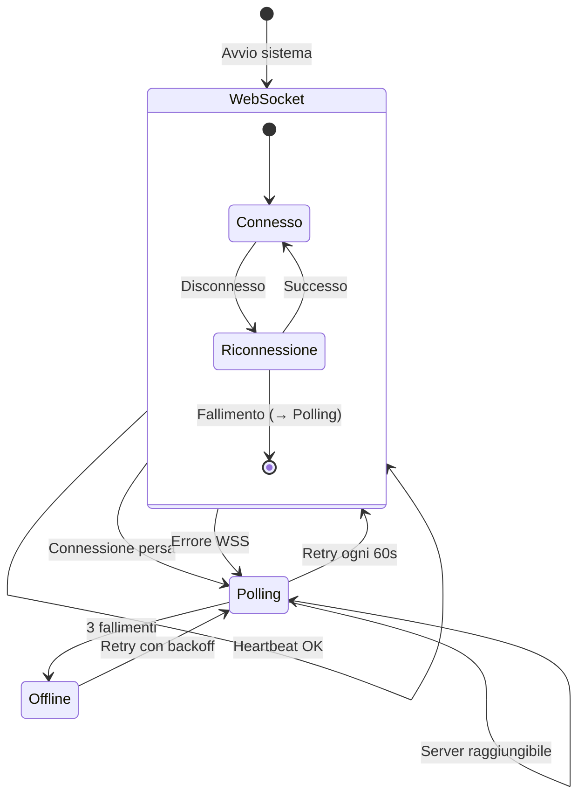

| Modalità | Protocollo | Latenza | Utilizzo |
|----------|------------|---------|----------|
| **WebSocket** | WSS (Laravel Reverb) | < 1 secondo | Primaria |
| **Polling** | HTTPS REST | 5-30 secondi | Fallback |

### 6.2 Flusso Ciclo di Vita Appliance

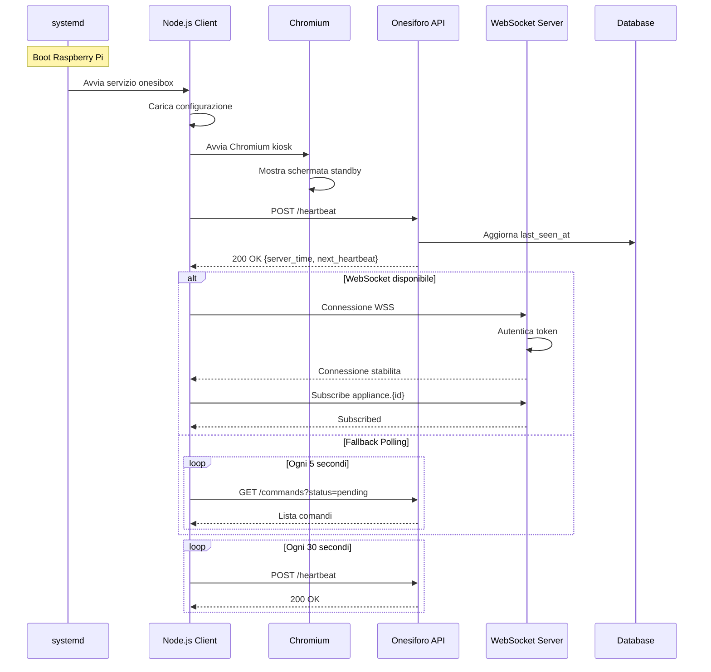

### 6.3 Flusso Esecuzione Comando

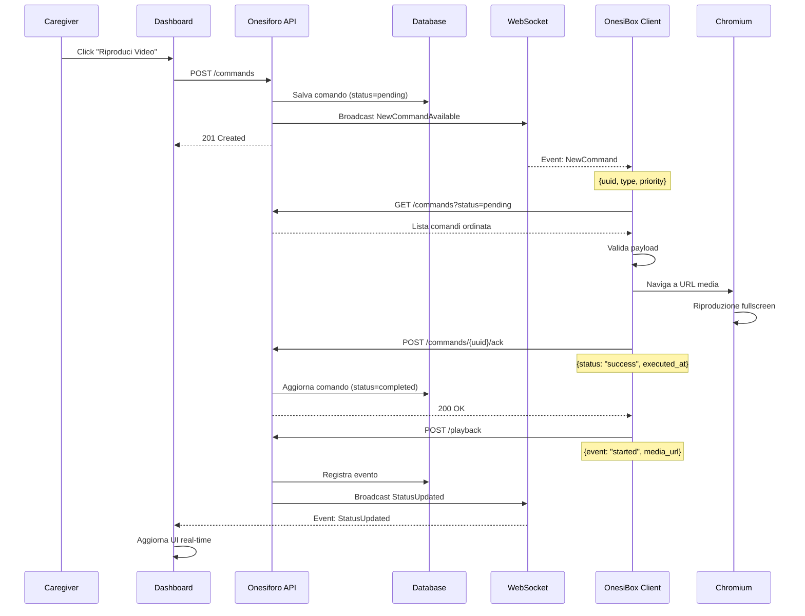

### 6.4 Stati del Dispositivo

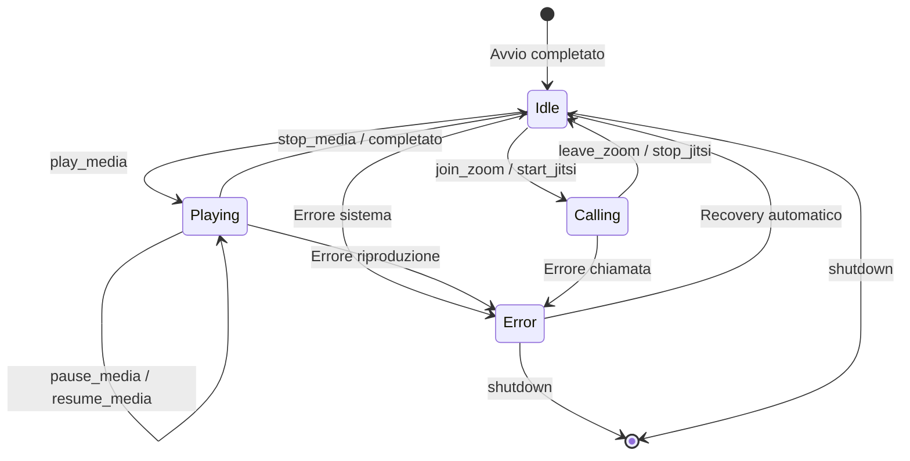

---

## 7. Specifica API

### 7.1 Autenticazione

Tutte le API richiedono autenticazione tramite **Laravel Sanctum**:

```http
Authorization: Bearer {appliance_token}
Content-Type: application/json
Accept: application/json
```

Il token viene generato dal pannello amministrativo al momento della registrazione dell'appliance e ha validità di 365 giorni.

### 7.2 Base URL

```
https://api.onesiforo.it/api/v1
```

### 7.3 Endpoint API

#### 7.3.1 Heartbeat

| Attributo | Valore |
|-----------|--------|
| **Endpoint** | `POST /appliances/heartbeat` |
| **Frequenza** | Ogni 30 secondi |
| **Autenticazione** | Bearer Token |

**Request:**
```json
{
  "status": "idle|playing|calling|error",
  "cpu_usage": 45,
  "memory_usage": 62,
  "disk_usage": 30,
  "temperature": 52.5,
  "uptime": 86400,
  "current_media": {
    "url": "https://...",
    "type": "video",
    "position": 120,
    "duration": 300
  }
}
```

**Response 200:**
```json
{
  "data": {
    "server_time": "2026-01-22T10:30:00+00:00",
    "next_heartbeat": 30
  }
}
```

#### 7.3.2 Recupero Comandi

| Attributo | Valore |
|-----------|--------|
| **Endpoint** | `GET /appliances/commands` |
| **Query Params** | `status=pending`, `limit=10` |
| **Autenticazione** | Bearer Token |

**Response 200:**
```json
{
  "data": [
    {
      "id": "550e8400-e29b-41d4-a716-446655440000",
      "type": "play_media",
      "payload": {
        "url": "https://www.jw.org/...",
        "type": "video"
      },
      "priority": 3,
      "status": "pending",
      "created_at": "2026-01-22T10:00:00+00:00",
      "expires_at": "2026-01-22T11:00:00+00:00"
    }
  ],
  "meta": {
    "total": 15,
    "pending": 2
  }
}
```

#### 7.3.3 Acknowledgment Comando

| Attributo | Valore |
|-----------|--------|
| **Endpoint** | `POST /commands/{uuid}/ack` |
| **Idempotente** | Sì |
| **Autenticazione** | Bearer Token |

**Request:**
```json
{
  "status": "success|failed|skipped",
  "error_code": "MEDIA_ERR",
  "error_message": "Formato non supportato",
  "executed_at": "2026-01-22T10:30:15+00:00"
}
```

**Response 200:**
```json
{
  "data": {
    "acknowledged": true,
    "command_id": "550e8400-e29b-41d4-a716-446655440000",
    "status": "completed"
  }
}
```

#### 7.3.4 Evento Riproduzione

| Attributo | Valore |
|-----------|--------|
| **Endpoint** | `POST /appliances/playback` |
| **Autenticazione** | Bearer Token |

**Request:**
```json
{
  "event": "started|paused|resumed|stopped|completed|error",
  "media_url": "https://...",
  "media_type": "audio|video",
  "position": 120,
  "duration": 300,
  "error_message": null
}
```

### 7.4 WebSocket Events

#### Canali

| Canale | Tipo | Sottoscrittori |
|--------|------|----------------|
| `private-appliance.{id}` | Privato | OnesiBox Client |
| `private-onesibox.{id}` | Privato | Dashboard Caregiver |

#### Eventi Server → Client

| Evento | Descrizione | Payload |
|--------|-------------|---------|
| `NewCommand` | Nuovo comando disponibile | `{uuid, type, priority, expires_at}` |
| `ConfigUpdated` | Configurazione aggiornata | `{key, value}` |

#### Eventi Client → Server (via API)

| Evento | Descrizione | Endpoint |
|--------|-------------|----------|
| `StatusUpdated` | Cambio stato appliance | POST /heartbeat |
| `CommandExecuted` | Comando completato | POST /commands/{uuid}/ack |
| `PlaybackChanged` | Evento playback | POST /playback |

---

## 8. Sicurezza

### 8.1 Panoramica Sicurezza

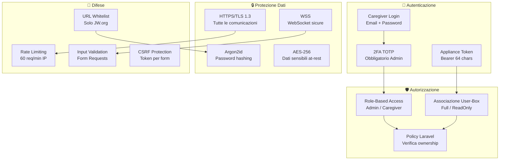

### 8.2 Misure di Sicurezza

| Area | Misura | Implementazione |
|------|--------|-----------------|
| **Trasporto** | Crittografia | HTTPS/TLS 1.3 obbligatorio |
| **Autenticazione Web** | Multi-fattore | TOTP via Google Authenticator |
| **Autenticazione API** | Token Bearer | Sanctum, 64 caratteri |
| **Rate Limiting** | Protezione DDoS | 60 req/min per IP |
| **Input Validation** | Sanitizzazione | Form Request classes |
| **XSS** | Protezione | Auto-escape Blade |
| **CSRF** | Protezione | Token Laravel |
| **SQL Injection** | Protezione | Prepared statements (Eloquent) |
| **Password** | Hashing | Argon2id |
| **Session** | Sicurezza | HttpOnly, Secure, SameSite=Strict |
| **Audit** | Logging | spatie/laravel-activitylog |

### 8.3 Domini Autorizzati (URL Whitelist)

```
# Contenuti JW.org
jw.org
www.jw.org
wol.jw.org
*.jw-cdn.org
download-a.akamaihd.net

# Videochiamate
zoom.us
*.zoom.us
meet.jit.si
*.jitsi.net
```

### 8.4 Hardening Raspberry Pi

- SSH disabilitato (accesso solo via Cloudflare Tunnel)
- Firewall (ufw) con regole minime
- Utente dedicato non-root per l'applicazione
- Partizione /tmp in RAM (tmpfs)
- Log rotation automatica
- Watchdog hardware abilitato

---

## 9. Requisiti

### 9.1 Requisiti Funzionali Prioritari

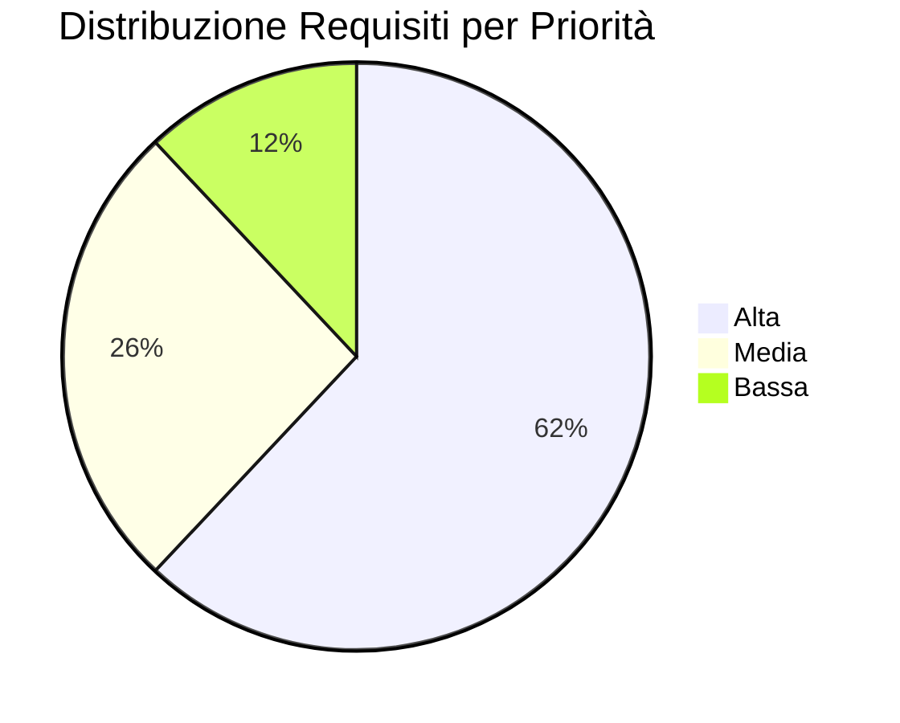

#### Server (Onesiforo)

| ID | Priorità | Requisito |
|----|----------|-----------|
| RF-001 | Alta | Riproduzione audio da JW.org |
| RF-002 | Alta | Riproduzione video da JW.org |
| RF-003 | Alta | Controllo riproduzione (play/pause/stop/volume) |
| RF-004 | Alta | Validazione URL JW.org |
| RF-005 | Alta | Visualizzazione stato online/offline |
| RF-006 | Alta | Visualizzazione stato riproduzione |
| RF-008 | Alta | Avvio riunione Zoom |
| RF-014 | Alta | CRUD Caregiver |
| RF-015 | Alta | CRUD Appliance |
| RF-016 | Alta | Associazione Caregiver-Appliance |
| RF-019 | Alta | Login Caregiver |
| RF-020 | Alta | Autenticazione 2FA |
| RF-022 | Alta | Activity Log audit |

#### Client (OnesiBox)

| ID | Priorità | Requisito |
|----|----------|-----------|
| RFC-001 | Alta | Connessione al server |
| RFC-002 | Alta | Ricezione comandi via polling |
| RFC-003 | Alta | Ricezione comandi via WebSocket |
| RFC-004 | Alta | Invio heartbeat |
| RFC-005 | Alta | Conferma esecuzione comandi |
| RFC-006 | Alta | Riproduzione video JW.org |
| RFC-010 | Alta | Partecipazione riunione Zoom |
| RFC-014 | Alta | Riavvio dispositivo |
| RFC-020 | Alta | Raccolta metriche sistema |
| RFC-023 | Alta | Watchdog applicativo |
| RFC-024 | Alta | Watchdog hardware |
| RFC-026 | Alta | Schermata di standby |

### 9.2 Requisiti Non Funzionali

| Categoria | Requisito | Specifica |
|-----------|-----------|-----------|
| **Prestazioni** | Tempo risposta UI | < 3 secondi |
| **Prestazioni** | Latenza comandi (WS) | < 1 secondo |
| **Prestazioni** | Latenza comandi (Polling) | < 10 secondi |
| **Prestazioni** | Capacità | 100+ appliance simultanee |
| **Affidabilità** | Disponibilità | 99.5% uptime |
| **Affidabilità** | Recovery | < 2 minuti dopo crash |
| **Sicurezza** | Crittografia | TLS 1.3 |
| **Sicurezza** | Password | Argon2id |
| **Usabilità** | Click per azione | Max 3 |
| **Usabilità** | Zero interazione beneficiario | 100% |
| **Manutenibilità** | Test coverage | > 80% |
| **Scalabilità** | Orizzontale | Multi-server ready |

---

## 10. Stack Tecnologico

### 10.1 Stack Completo

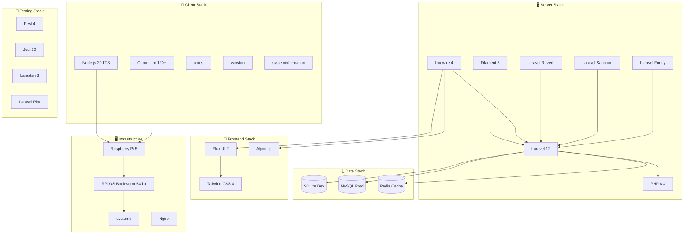

### 10.2 Dipendenze Principali

#### Server (composer.json)

| Package | Versione | Scopo |
|---------|----------|-------|
| `laravel/framework` | ^12.0 | Core framework |
| `filament/filament` | ^5.0 | Admin panel |
| `livewire/livewire` | ^4.0 | Reactive components |
| `livewire/flux` | ^2.0 | UI components |
| `laravel/reverb` | ^1.0 | WebSocket server |
| `laravel/sanctum` | ^4.0 | API authentication |
| `laravel/fortify` | ^1.0 | Auth scaffolding |
| `spatie/laravel-activitylog` | ^4.0 | Audit logging |
| `larastan/larastan` | ^3.0 | Static analysis |
| `pestphp/pest` | ^4.0 | Testing |
| `laravel/pint` | ^1.0 | Code style |

#### Client (package.json)

| Package | Versione | Scopo |
|---------|----------|-------|
| `axios` | ^1.x | HTTP client |
| `winston` | ^3.x | Logging |
| `winston-daily-rotate-file` | ^5.x | Log rotation |
| `systeminformation` | ^5.x | System metrics |
| `jest` | ^30.x | Testing |
| `eslint` | ^9.x | Linting |

---

## 11. Deployment e Infrastruttura

### 11.1 Architettura di Deployment

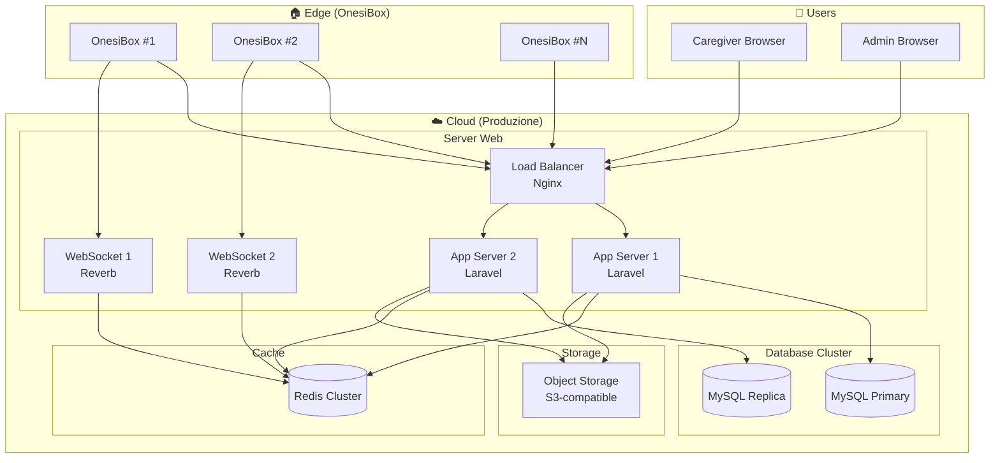

### 11.2 Setup Raspberry Pi

#### Script di Installazione

```bash
#!/bin/bash
# scripts/setup.sh

# Installa dipendenze
sudo apt update
sudo apt install -y chromium-browser x11-xserver-utils \
    unclutter espeak-ng x11vnc

# Installa Node.js 20 LTS
curl -fsSL https://deb.nodesource.com/setup_20.x | sudo -E bash -
sudo apt install -y nodejs

# Clona repository
cd /opt
sudo git clone https://github.com/onesiphorus-team/onesibox-client.git onesibox
cd onesibox
sudo npm install --production

# Configura servizio systemd
sudo cp scripts/onesibox.service /etc/systemd/system/
sudo systemctl daemon-reload
sudo systemctl enable onesibox
sudo systemctl start onesibox

# Abilita watchdog hardware
echo "dtparam=watchdog=on" | sudo tee -a /boot/config.txt
```

#### Servizio systemd

```ini
[Unit]
Description=OnesiBox Client
After=network-online.target graphical.target
Wants=network-online.target

[Service]
Type=simple
User=pi
WorkingDirectory=/opt/onesibox
ExecStart=/usr/bin/node main.js
Restart=always
RestartSec=10
WatchdogSec=60
Environment=NODE_ENV=production

[Install]
WantedBy=multi-user.target
```

### 11.3 Configurazione Chromium Kiosk

```bash
chromium-browser \
  --kiosk \
  --noerrdialogs \
  --disable-infobars \
  --disable-session-crashed-bubble \
  --disable-restore-session-state \
  --autoplay-policy=no-user-gesture-required \
  --use-fake-ui-for-media-stream \
  --enable-features=WebRTCPipeWireCapturer \
  --disable-features=TranslateUI \
  --check-for-update-interval=31536000 \
  --disable-component-update \
  --disable-background-networking \
  --disable-sync \
  --disable-default-apps \
  --no-first-run \
  --start-fullscreen \
  http://localhost:3000
```

---

## 12. Roadmap

### 12.1 Timeline di Sviluppo

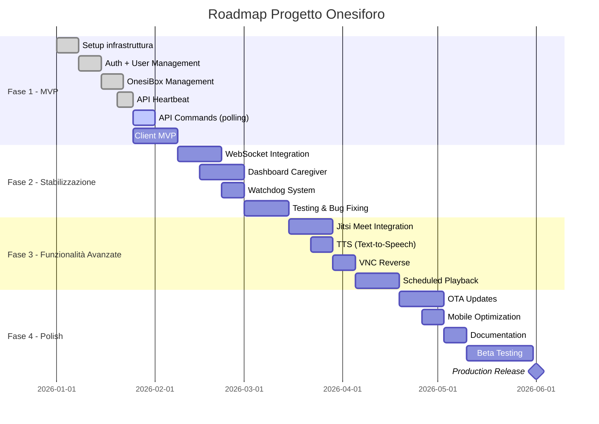

### 12.2 Milestone e Deliverable

#### Fase 1 - MVP (Gennaio 2026)

| Deliverable | Stato | Note |
|-------------|-------|------|
| ✅ Setup Laravel 12 + Filament 5 | Completato | - |
| ✅ User Management con ruoli | Completato | Admin, Caregiver |
| ✅ CRUD Beneficiario | Completato | Con soft delete |
| ✅ CRUD OnesiBox | Completato | Con token generation |
| ✅ API Heartbeat | Completato | Con metriche sistema |
| 🔄 API Commands (GET/ACK) | In corso | Polling mode |
| 🔄 API Playback Events | In corso | - |
| ⏳ Client Node.js MVP | Pianificato | - |

#### Fase 2 - Stabilizzazione (Febbraio 2026)

| Deliverable | Stato |
|-------------|-------|
| ⏳ Integrazione Laravel Reverb | Pianificato |
| ⏳ Dashboard Caregiver Livewire | Pianificato |
| ⏳ Watchdog multi-livello | Pianificato |
| ⏳ Test coverage > 80% | Pianificato |

#### Fase 3 - Funzionalità Avanzate (Marzo-Aprile 2026)

| Deliverable | Stato |
|-------------|-------|
| ⏳ Jitsi Meet integration | Pianificato |
| ⏳ TTS (espeak-ng + Web Speech) | Pianificato |
| ⏳ VNC Reverse | Pianificato |
| ⏳ Programmazione automatica | Pianificato |

#### Fase 4 - Production Ready (Maggio-Giugno 2026)

| Deliverable | Stato |
|-------------|-------|
| ⏳ OTA Updates | Pianificato |
| ⏳ Ottimizzazione mobile | Pianificato |
| ⏳ Documentazione completa | Pianificato |
| ⏳ Beta testing | Pianificato |
| ⏳ Release produzione | Pianificato |

---

## 13. Glossario

| Termine | Definizione |
|---------|-------------|
| **Appliance** | Dispositivo OnesiBox basato su Raspberry Pi |
| **Beneficiario** | Persona anziana assistita che utilizza l'OnesiBox |
| **Caregiver** | Operatore autorizzato a controllare una o più appliance |
| **Command** | Istruzione inviata dal server all'appliance |
| **Heartbeat** | Segnale periodico per confermare connettività e stato |
| **Kiosk Mode** | Modalità browser fullscreen senza controlli utente |
| **Polling** | Tecnica di recupero dati basata su richieste periodiche |
| **TTS** | Text-to-Speech, sintesi vocale |
| **VNC** | Virtual Network Computing, controllo remoto desktop |
| **Watchdog** | Componente di monitoraggio e auto-riparazione |
| **WebSocket** | Protocollo per comunicazione bidirezionale real-time |

---

## 14. Appendici

### 14.1 Codici di Errore

#### Server

| Codice | HTTP | Descrizione |
|--------|------|-------------|
| E001 | 401 | Token non valido |
| E002 | 404 | Risorsa non trovata |
| E003 | 403 | Non autorizzato |
| E004 | 410 | Comando scaduto |
| E005 | 422 | URL media non valido |
| E006 | 422 | Tipo comando non supportato |
| E007 | 503 | Appliance offline |
| E008 | 429 | Rate limit superato |
| E009 | 500 | Errore interno |
| E010 | 408 | Timeout esecuzione |

#### Client

| Codice | Descrizione |
|--------|-------------|
| C001 | Errore connessione server |
| C002 | Token non valido |
| C003 | Comando non riconosciuto |
| C004 | Payload non valido |
| C005 | URL non raggiungibile |
| C006 | Errore riproduzione |
| C007 | Errore Zoom |
| C008 | Errore TTS |
| C009 | Errore VNC |
| C010 | Risorse insufficienti |

### 14.2 Struttura Payload Comandi

#### play_media

```json
{
  "url": "https://www.jw.org/...",
  "type": "video|audio",
  "title": "Titolo opzionale",
  "loop": false,
  "volume": 80
}
```

#### join_zoom

```json
{
  "meeting_id": "123456789",
  "password": "abc123",
  "display_name": "Nome visualizzato"
}
```

#### speak_text

```json
{
  "text": "Messaggio da leggere",
  "language": "it-IT",
  "speed": 1.0,
  "voice": "female"
}
```

#### show_message

```json
{
  "title": "Titolo",
  "body": "Corpo del messaggio",
  "duration": 30,
  "type": "info|warning|alert",
  "sound": true
}
```

### 14.3 Configurazione Client

```json
{
  "server_url": "https://api.onesiforo.it/api/v1",
  "appliance_id": "uuid-here",
  "appliance_token": "token-here",
  "polling_interval_seconds": 5,
  "heartbeat_interval_seconds": 30,
  "websocket_enabled": true,
  "default_volume": 80,
  "watchdog_enabled": true,
  "watchdog_timeout_seconds": 60,
  "tts_engine": "espeak",
  "tts_language": "it"
}
```

### 14.4 Riferimenti

- [Laravel 12 Documentation](https://laravel.com/docs/12.x)
- [Filament 5 Documentation](https://filamentphp.com/docs)
- [Livewire 4 Documentation](https://livewire.laravel.com/docs)
- [Laravel Reverb Documentation](https://laravel.com/docs/reverb)
- [Raspberry Pi Documentation](https://www.raspberrypi.com/documentation/)
- [Chromium Command Line Switches](https://peter.sh/experiments/chromium-command-line-switches/)

---

## Storico Revisioni

| Versione | Data | Autore | Modifiche |
|----------|------|--------|-----------|
| 1.0 | Gennaio 2026 | Team Onesiphorus | Prima stesura completa |

---

**Onesiphorus Team** - *"Per la premura mostrata"*
