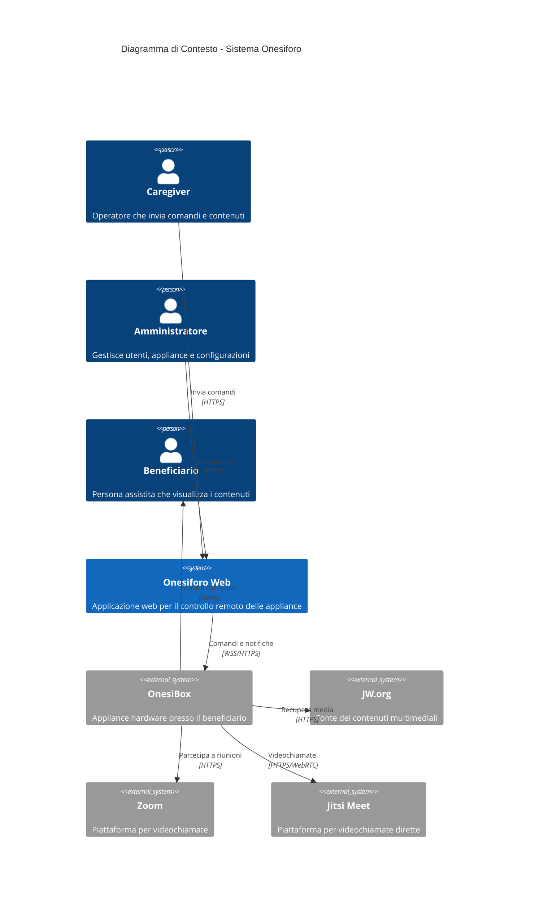
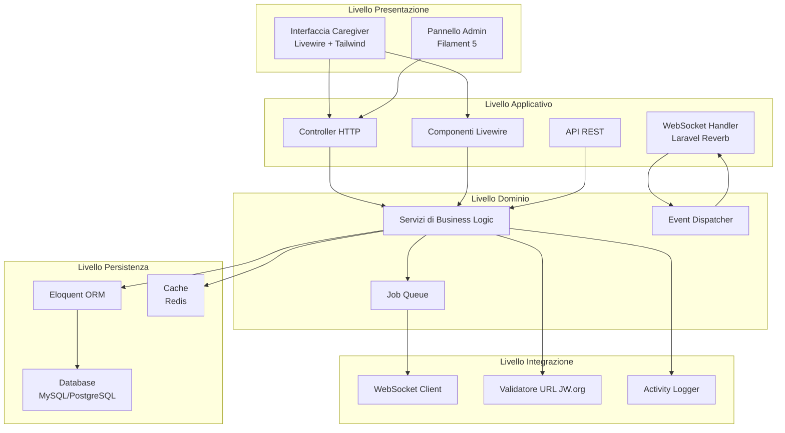
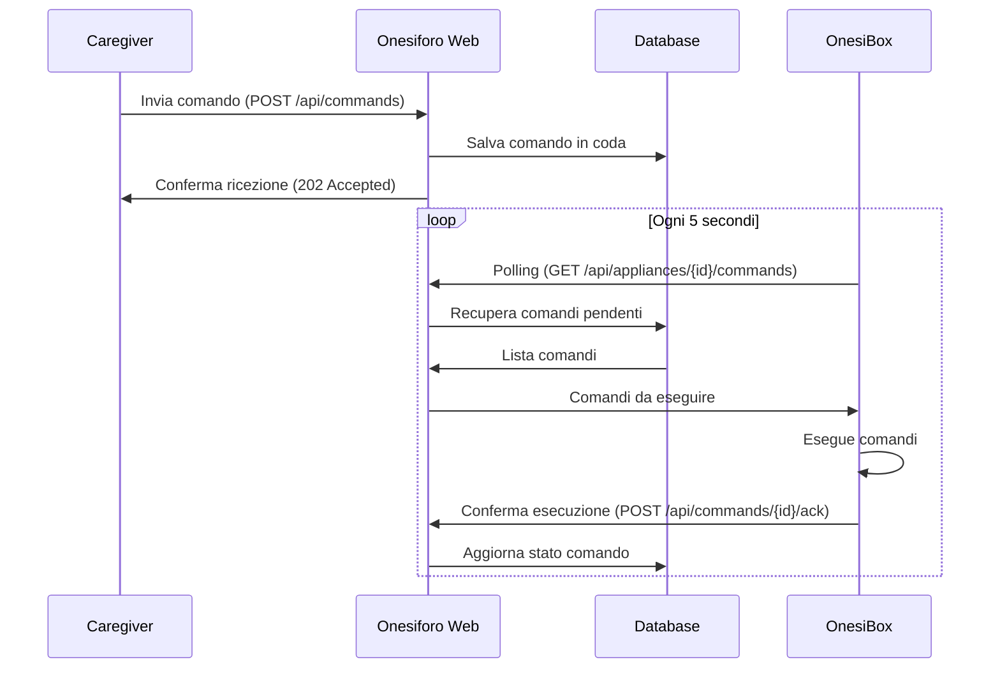
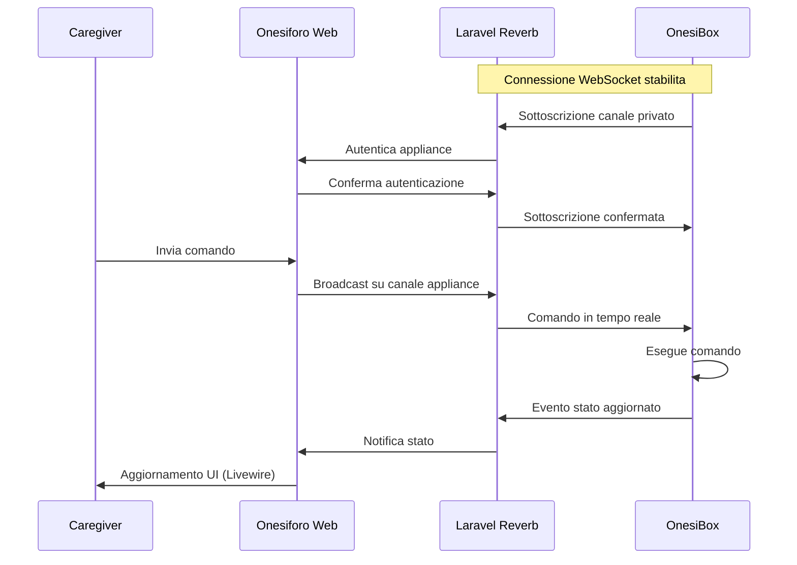
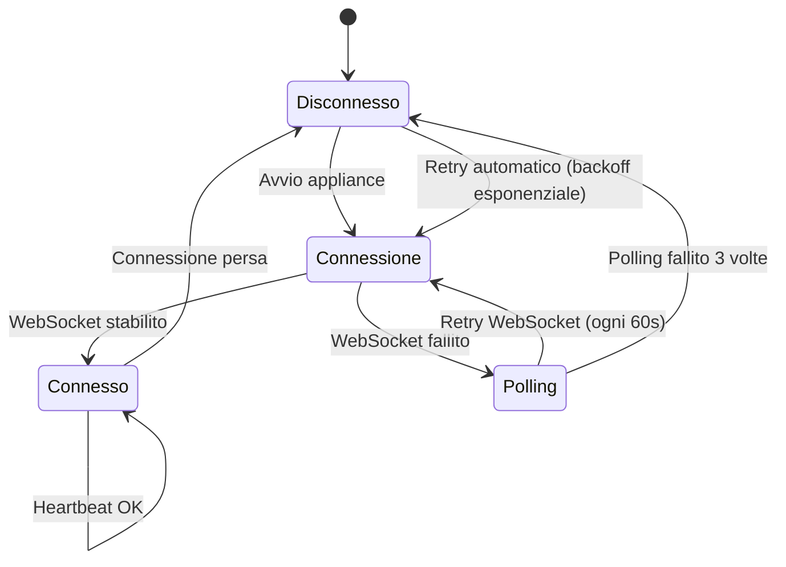
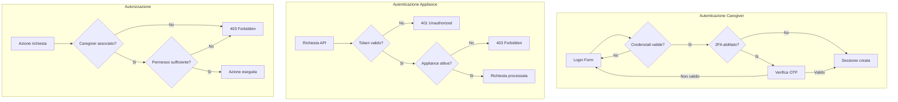

# Architettura del Sistema Onesiforo

**Versione:** 1.0
**Data:** Gennaio 2026
**Stato:** Draft

---

## 1. Introduzione

Questo documento descrive l'architettura tecnica del sistema Onesiforo, una piattaforma per il controllo remoto di appliance OnesiBox destinate all'assistenza di persone anziane con mobilita ridotta.

### 1.1 Scopo del Documento

Il documento fornisce una visione completa dell'architettura del sistema, descrivendo:

- I componenti principali e le loro responsabilita
- I pattern architetturali adottati
- I protocolli di comunicazione tra i componenti
- Le API esposte per l'integrazione con le appliance
- Le scelte tecnologiche e le relative motivazioni

### 1.2 Glossario

| Termine | Definizione |
|---------|-------------|
| **OnesiBox** | Appliance hardware basata su Raspberry Pi installata presso l'utente finale |
| **Caregiver** | Operatore autorizzato che controlla remotamente una o piu appliance |
| **Beneficiario** | Persona anziana assistita che usufruisce dei contenuti mostrati sull'appliance |
| **Comando** | Istruzione inviata dal caregiver all'appliance (es. riproduzione video) |
| **Heartbeat** | Segnale periodico inviato dall'appliance per confermare la connettivita |

---

## 2. Panoramica dell'Architettura

Il sistema Onesiforo adotta un'architettura **client-server** con comunicazione bidirezionale, dove l'applicazione web funge da hub centrale tra i caregiver e le appliance distribuite.

### 2.1 Diagramma di Contesto



### 2.2 Principi Architetturali

L'architettura e stata progettata seguendo questi principi fondamentali:

1. **Semplicita per l'utente finale**: Il beneficiario non deve interagire con alcun dispositivo
2. **Resilienza**: Il sistema deve gestire disconnessioni temporanee e ripristinarsi automaticamente
3. **Scalabilita**: L'architettura deve supportare un numero crescente di appliance
4. **Sicurezza**: Tutte le comunicazioni devono essere cifrate e autenticate
5. **Affidabilita**: Il sistema deve garantire la consegna dei comandi alle appliance

---

## 3. Componenti del Sistema

### 3.1 Architettura a Livelli



### 3.2 Descrizione dei Componenti

#### 3.2.1 Interfaccia Caregiver (Livewire)

Applicazione web reattiva costruita con Livewire 4 e Tailwind CSS 4. Fornisce:

- Dashboard con stato in tempo reale delle appliance assegnate
- Form per l'invio di contenuti multimediali
- Pannello di controllo per Zoom e videochiamate
- Cronologia delle azioni eseguite
- Gestione delle programmazioni automatiche

#### 3.2.2 Pannello Amministrativo (Filament 5)

Interfaccia di amministrazione completa per:

- CRUD degli utenti caregiver
- CRUD delle appliance registrate
- Gestione delle associazioni caregiver-appliance
- Visualizzazione dei log di sistema
- Configurazione delle impostazioni globali

#### 3.2.3 API REST

Endpoint HTTP per la comunicazione con le appliance in modalita polling. Utilizzati nella Fase 1 del progetto e mantenuti come fallback.

#### 3.2.4 WebSocket Server (Laravel Reverb)

Server WebSocket per la comunicazione bidirezionale in tempo reale. Gestisce:

- Canali privati per ogni appliance
- Broadcast di comandi dal caregiver all'appliance
- Ricezione di eventi di stato dall'appliance
- Gestione della presenza (online/offline)

#### 3.2.5 Event Dispatcher

Sistema di eventi Laravel per il disaccoppiamento tra componenti:

- Eventi di comando (CommandDispatched, CommandExecuted)
- Eventi di stato (ApplianceOnline, ApplianceOffline)
- Eventi di riproduzione (PlaybackStarted, PlaybackStopped)

#### 3.2.6 Job Queue

Coda asincrona per operazioni che non richiedono risposta immediata:

- Invio notifiche push
- Elaborazione log
- Pulizia dati storici
- Retry di comandi falliti

---

## 4. Pattern di Comunicazione

### 4.1 Modalita di Comunicazione

Il sistema supporta due modalita di comunicazione, selezionabili in base alla fase di implementazione e alle condizioni di rete:

| Modalita | Protocollo | Latenza | Uso Risorse | Fase |
|----------|------------|---------|-------------|------|
| Polling | HTTP/REST | Alta (5-30s) | Medio | Fase 1 |
| WebSocket | WSS | Bassa (<1s) | Basso | Fase 2 |

### 4.2 Flusso di Comunicazione - Polling (Fase 1)



### 4.3 Flusso di Comunicazione - WebSocket (Fase 2)



### 4.4 Gestione della Connettivita



---

## 5. Specifica delle API

### 5.1 Autenticazione

Tutte le API richiedono autenticazione tramite token. Le appliance utilizzano token statici generati al momento della registrazione e memorizzati in modo sicuro.

#### Header di Autenticazione

```
Authorization: Bearer {appliance_token}
X-Appliance-ID: {appliance_uuid}
```

### 5.2 Endpoint REST per Appliance

#### 5.2.1 Registrazione Appliance

Registra una nuova appliance nel sistema.

| Attributo | Valore |
|-----------|--------|
| **Metodo** | `POST` |
| **Path** | `/api/v1/appliances/register` |
| **Autenticazione** | Token di provisioning |
| **Content-Type** | `application/json` |

**Request Body:**

| Campo | Tipo | Obbligatorio | Descrizione |
|-------|------|--------------|-------------|
| `serial_number` | string | Si | Numero seriale univoco dell'appliance |
| `hardware_id` | string | Si | Identificativo hardware (MAC address) |
| `firmware_version` | string | Si | Versione del firmware installato |
| `hostname` | string | No | Nome host dell'appliance |

**Response (201 Created):**

| Campo | Tipo | Descrizione |
|-------|------|-------------|
| `appliance_id` | uuid | Identificativo univoco assegnato |
| `token` | string | Token di autenticazione per le richieste future |
| `websocket_url` | string | URL per la connessione WebSocket |
| `websocket_channel` | string | Nome del canale privato da sottoscrivere |

---

#### 5.2.2 Heartbeat

Segnale periodico per confermare che l'appliance e online e funzionante.

| Attributo | Valore |
|-----------|--------|
| **Metodo** | `POST` |
| **Path** | `/api/v1/appliances/{id}/heartbeat` |
| **Autenticazione** | Token appliance |
| **Frequenza** | Ogni 30 secondi |

**Request Body:**

| Campo | Tipo | Obbligatorio | Descrizione |
|-------|------|--------------|-------------|
| `status` | enum | Si | Stato corrente: `idle`, `playing`, `calling`, `error` |
| `cpu_usage` | integer | No | Percentuale utilizzo CPU (0-100) |
| `memory_usage` | integer | No | Percentuale utilizzo RAM (0-100) |
| `disk_usage` | integer | No | Percentuale utilizzo disco (0-100) |
| `temperature` | float | No | Temperatura CPU in gradi Celsius |
| `uptime` | integer | No | Secondi dall'ultimo avvio |
| `current_media` | object | No | Informazioni sul media in riproduzione |

**Response (200 OK):**

| Campo | Tipo | Descrizione |
|-------|------|-------------|
| `server_time` | datetime | Timestamp del server (ISO 8601) |
| `next_heartbeat` | integer | Secondi prima del prossimo heartbeat atteso |

---

#### 5.2.3 Recupero Comandi (Polling)

Recupera i comandi pendenti da eseguire.

| Attributo | Valore |
|-----------|--------|
| **Metodo** | `GET` |
| **Path** | `/api/v1/appliances/{id}/commands` |
| **Autenticazione** | Token appliance |

**Query Parameters:**

| Parametro | Tipo | Default | Descrizione |
|-----------|------|---------|-------------|
| `status` | enum | `pending` | Filtro per stato: `pending`, `all` |
| `limit` | integer | 10 | Numero massimo di comandi da restituire |

**Response (200 OK):**

| Campo | Tipo | Descrizione |
|-------|------|-------------|
| `commands` | array | Lista dei comandi pendenti |
| `commands[].id` | uuid | Identificativo univoco del comando |
| `commands[].type` | enum | Tipo di comando |
| `commands[].payload` | object | Dati specifici del comando |
| `commands[].priority` | integer | Priorita (1=alta, 5=bassa) |
| `commands[].created_at` | datetime | Timestamp di creazione |
| `commands[].expires_at` | datetime | Timestamp di scadenza (null se non scade) |

---

#### 5.2.4 Conferma Esecuzione Comando

Conferma l'avvenuta esecuzione di un comando.

| Attributo | Valore |
|-----------|--------|
| **Metodo** | `POST` |
| **Path** | `/api/v1/commands/{id}/ack` |
| **Autenticazione** | Token appliance |

**Request Body:**

| Campo | Tipo | Obbligatorio | Descrizione |
|-------|------|--------------|-------------|
| `status` | enum | Si | Esito: `success`, `failed`, `skipped` |
| `error_code` | string | No | Codice errore (se status=failed) |
| `error_message` | string | No | Messaggio errore (se status=failed) |
| `executed_at` | datetime | Si | Timestamp esecuzione (ISO 8601) |

**Response (200 OK):**

| Campo | Tipo | Descrizione |
|-------|------|-------------|
| `acknowledged` | boolean | Conferma ricezione |

---

#### 5.2.5 Aggiornamento Stato Riproduzione

Notifica l'avvio o l'arresto di una riproduzione.

| Attributo | Valore |
|-----------|--------|
| **Metodo** | `POST` |
| **Path** | `/api/v1/appliances/{id}/playback` |
| **Autenticazione** | Token appliance |

**Request Body:**

| Campo | Tipo | Obbligatorio | Descrizione |
|-------|------|--------------|-------------|
| `event` | enum | Si | Evento: `started`, `paused`, `resumed`, `stopped`, `completed`, `error` |
| `media_url` | string | Si | URL del contenuto |
| `media_type` | enum | Si | Tipo: `audio`, `video` |
| `position` | integer | No | Posizione corrente in secondi |
| `duration` | integer | No | Durata totale in secondi |
| `error_message` | string | No | Messaggio errore (se event=error) |

**Response (200 OK):**

| Campo | Tipo | Descrizione |
|-------|------|-------------|
| `logged` | boolean | Conferma registrazione evento |

---

### 5.3 Tipi di Comando

La tabella seguente elenca tutti i tipi di comando supportati:

| Tipo | Descrizione | Payload |
|------|-------------|---------|
| `play_media` | Riproduce un contenuto audio/video | `url`, `media_type`, `autoplay` |
| `stop_media` | Interrompe la riproduzione corrente | - |
| `pause_media` | Mette in pausa la riproduzione | - |
| `resume_media` | Riprende la riproduzione | - |
| `set_volume` | Imposta il volume | `level` (0-100) |
| `join_zoom` | Avvia una riunione Zoom | `meeting_url`, `meeting_id`, `password` |
| `leave_zoom` | Termina la riunione Zoom | - |
| `start_jitsi` | Avvia videochiamata Jitsi | `room_name`, `display_name` |
| `stop_jitsi` | Termina videochiamata Jitsi | - |
| `speak_text` | Sintetizza testo in voce | `text`, `language`, `voice` |
| `show_message` | Mostra messaggio a schermo | `title`, `body`, `duration` |
| `reboot` | Riavvia l'appliance | `delay` (secondi) |
| `shutdown` | Spegne l'appliance | `delay` (secondi) |
| `start_vnc` | Avvia sessione VNC reverse | `server_host`, `server_port` |
| `stop_vnc` | Termina sessione VNC | - |
| `update_config` | Aggiorna configurazione | `config_key`, `config_value` |

---

### 5.4 WebSocket Events

#### 5.4.1 Canali

| Canale | Tipo | Descrizione |
|--------|------|-------------|
| `private-appliance.{id}` | Privato | Canale dedicato per ogni appliance |
| `presence-appliances` | Presenza | Monitoraggio presenza globale |

#### 5.4.2 Eventi Server -> Appliance

| Evento | Payload | Descrizione |
|--------|---------|-------------|
| `command.dispatched` | Oggetto comando completo | Nuovo comando da eseguire |
| `config.updated` | Chiave e valore aggiornati | Configurazione modificata |
| `connection.ping` | Timestamp | Verifica connessione |

#### 5.4.3 Eventi Appliance -> Server

| Evento | Payload | Descrizione |
|--------|---------|-------------|
| `status.updated` | Stato completo appliance | Aggiornamento stato |
| `command.executed` | ID e risultato comando | Conferma esecuzione |
| `playback.changed` | Dettagli riproduzione | Cambio stato riproduzione |
| `error.occurred` | Codice e messaggio | Errore rilevato |

---

## 6. Sicurezza

### 6.1 Autenticazione e Autorizzazione



### 6.2 Misure di Sicurezza Implementate

| Area | Misura | Implementazione |
|------|--------|-----------------|
| Trasporto | Crittografia | HTTPS/TLS 1.3 obbligatorio |
| Autenticazione | 2FA | TOTP via Google Authenticator |
| API | Rate Limiting | Laravel Throttle (60 req/min) |
| Input | Validazione | Form Request + Sanitizzazione |
| XSS | Protezione | Escape automatico Blade |
| CSRF | Protezione | Token Laravel su ogni form |
| SQL Injection | Protezione | Prepared statements (Eloquent) |
| Session | Sicurezza | HttpOnly, Secure, SameSite=Strict |
| Password | Hashing | Argon2id |
| Token | Generazione | `Str::random(64)` crittograficamente sicuro |
| Audit | Logging | spatie/laravel-activitylog |

### 6.3 Validazione URL JW.org

I link multimediali sono validati per garantire che provengano esclusivamente da domini autorizzati:

- `jw.org`
- `www.jw.org`
- `wol.jw.org`
- `*.jw-cdn.org`
- `download-a.akamaihd.net`

---

## 7. Monitoraggio e Logging

### 7.1 Metriche Monitorate

| Metrica | Descrizione | Soglia Alert |
|---------|-------------|--------------|
| Appliance offline | Tempo dall'ultimo heartbeat | > 5 minuti |
| Comandi falliti | Percentuale comandi non eseguiti | > 5% |
| Latenza API | Tempo risposta endpoint | > 500ms |
| Errori 5xx | Errori server | > 1% richieste |
| Queue depth | Comandi in coda | > 100 |

### 7.2 Struttura Log

Tutti i log seguono il formato PSR-3 e sono inviati a:

- File locale (storage/logs)
- Aggregatore centralizzato (opzionale)

---

## 8. Roadmap Tecnica

### Fase 1 - MVP (Settimana 1)

- Comunicazione HTTP polling
- Funzionalita base (play media, Zoom)
- Pannello caregiver essenziale

### Fase 2 - Stabilizzazione (Mese 1)

- Migrazione a WebSocket
- Sistema di watchdog
- Logging e monitoraggio avanzato

### Fase 3 - Funzionalita Avanzate (Futuro)

- Videochiamata Jitsi
- Text-to-Speech
- VNC reverse
- Programmazioni automatiche

---

## 9. Appendici

### A. Codici di Errore

| Codice | Descrizione |
|--------|-------------|
| `E001` | Token di autenticazione non valido |
| `E002` | Appliance non trovata |
| `E003` | Appliance non associata al caregiver |
| `E004` | Comando scaduto |
| `E005` | URL media non valido |
| `E006` | Tipo di comando non supportato |
| `E007` | Appliance offline |
| `E008` | Rate limit superato |
| `E009` | Errore interno del server |
| `E010` | Timeout esecuzione comando |

### B. Riferimenti

- Laravel 12 Documentation
- Laravel Reverb Documentation
- Filament 5 Documentation
- Livewire 4 Documentation
