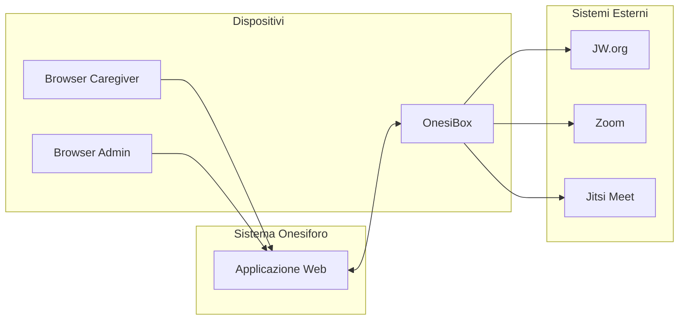
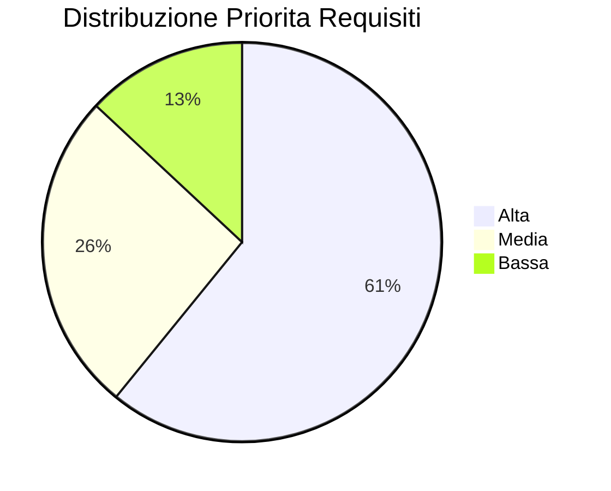
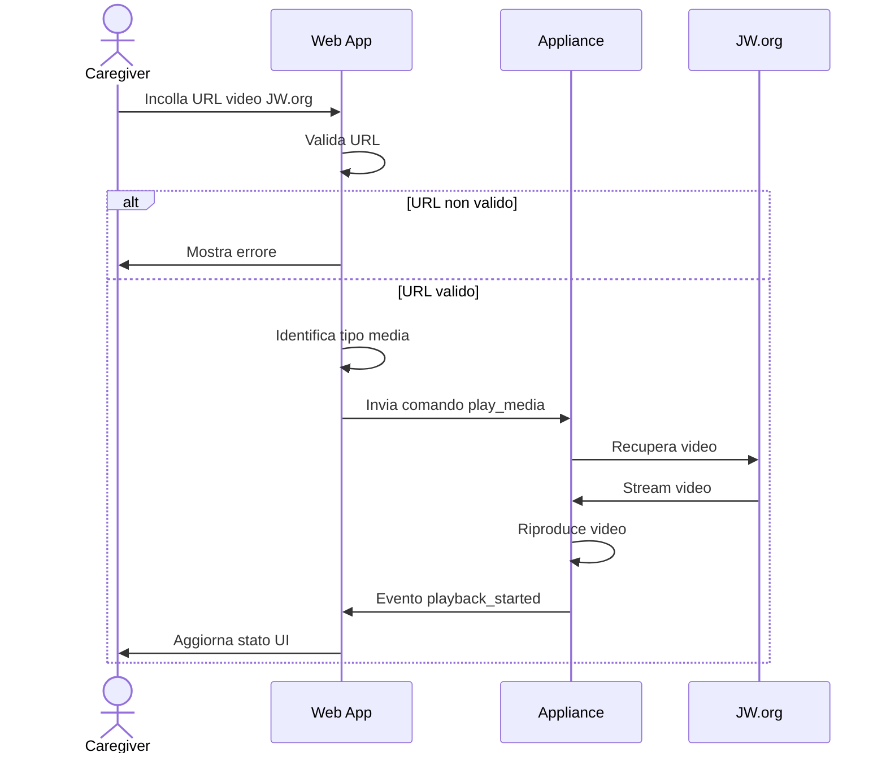
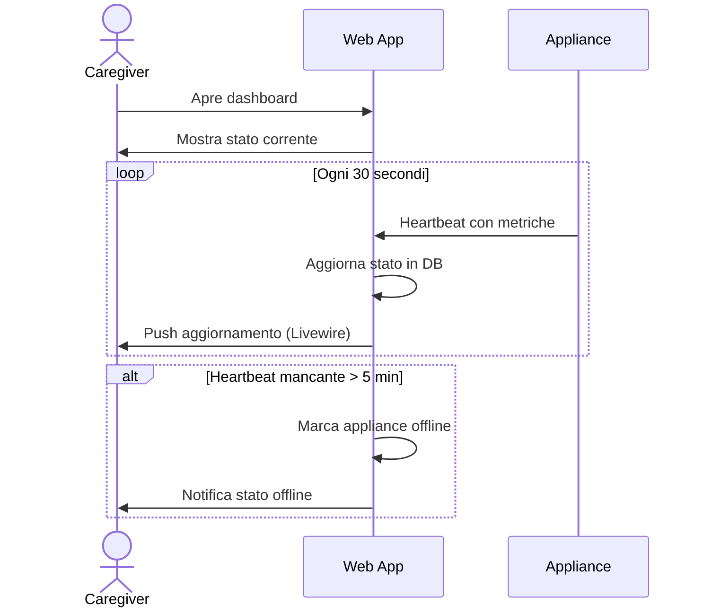
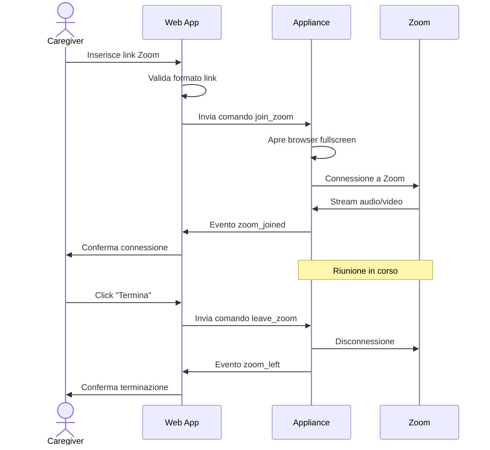

# Specifica dei Requisiti - Sistema Onesiforo

**Versione:** 1.0
**Data:** Gennaio 2026
**Stato:** Draft

---

## 1. Introduzione

### 1.1 Scopo del Documento

Questo documento definisce i requisiti funzionali e non funzionali del sistema Onesiforo, comprendente l'applicazione web per i caregiver e l'interfaccia di comunicazione con le appliance OnesiBox.

### 1.2 Ambito del Sistema

Il sistema Onesiforo e una piattaforma di controllo remoto che permette ai caregiver di gestire appliance OnesiBox installate presso persone anziane con mobilita ridotta. Il sistema consente l'invio di contenuti multimediali, la gestione di videochiamate e il monitoraggio dello stato dei dispositivi.

### 1.3 Definizioni e Acronimi

| Termine | Definizione |
|---------|-------------|
| **Appliance** | Dispositivo OnesiBox basato su Raspberry Pi |
| **Caregiver** | Operatore autorizzato a controllare una o piu appliance |
| **Beneficiario** | Persona anziana assistita tramite l'appliance |
| **TTS** | Text-to-Speech, sintesi vocale |
| **VNC** | Virtual Network Computing, controllo remoto desktop |
| **2FA** | Two-Factor Authentication, autenticazione a due fattori |

### 1.4 Riferimenti

- Documento di Architettura del Sistema (architettura.md)
- Specifiche OnesiBox (OnesiBox_Specifiche.pdf)

---

## 2. Descrizione Generale

### 2.1 Prospettiva del Prodotto

Il sistema Onesiforo si inserisce in un ecosistema piu ampio composto da:

### 2.2 Utenti del Sistema

#### 2.2.1 Beneficiario

- **Profilo**: Persona anziana con mobilita ridotta, nessuna competenza tecnologica
- **Interazione**: Nessuna interazione richiesta con il dispositivo
- **Obiettivo**: Ricevere contenuti spirituali e rimanere in contatto con i propri cari

#### 2.2.2 Caregiver

- **Profilo**: Familiare o membro della comunita che assiste il beneficiario
- **Competenze**: Utilizzo base di smartphone/tablet, nessuna competenza tecnica avanzata
- **Obiettivo**: Inviare contenuti e gestire il dispositivo da remoto in modo semplice

#### 2.2.3 Amministratore di Sistema

- **Profilo**: Tecnico responsabile della gestione della piattaforma
- **Competenze**: Conoscenza base di sistemi web e database
- **Obiettivo**: Gestire utenti, appliance e configurazioni di sistema

### 2.3 Vincoli di Progetto

| Vincolo | Descrizione |
|---------|-------------|
| **Connettivita** | Le appliance operano su reti LTE senza IP pubblico |
| **Hardware** | Raspberry Pi 5 con risorse limitate |
| **Utenti finali** | Interfaccia estremamente semplice, zero interazione richiesta |
| **Affidabilita** | Sistema auto-riparante, funzionamento 24/7 |
| **Privacy** | Conformita normative privacy, dati sensibili |

### 2.4 Assunzioni e Dipendenze

- Le appliance hanno accesso a Internet tramite rete LTE
- I contenuti JW.org sono accessibili pubblicamente
- Il servizio Zoom e disponibile via browser
- Laravel Reverb e operativo per le WebSocket

---

## 3. Requisiti Funzionali

### 3.1 Gestione Contenuti Multimediali

#### RF-001: Riproduzione Audio da JW.org

| Attributo | Valore |
|-----------|--------|
| **ID** | RF-001 |
| **Priorita** | Alta |
| **Descrizione** | Il sistema deve permettere al caregiver di inviare link audio da JW.org all'appliance per la riproduzione |

**Criteri di Accettazione:**
- Il caregiver puo inserire un URL audio da JW.org in un campo di testo
- Il sistema valida che l'URL appartenga ai domini autorizzati JW.org
- Il sistema valida che l'URL punti a un file audio valido
- L'appliance riceve il comando e avvia la riproduzione automaticamente
- Il caregiver visualizza lo stato della riproduzione in tempo reale

---

#### RF-002: Riproduzione Video da JW.org

| Attributo | Valore |
|-----------|--------|
| **ID** | RF-002 |
| **Priorita** | Alta |
| **Descrizione** | Il sistema deve permettere al caregiver di inviare link video da JW.org all'appliance per la riproduzione |

**Criteri di Accettazione:**
- Il caregiver puo inserire un URL video da JW.org in un campo di testo
- Il sistema valida che l'URL appartenga ai domini autorizzati JW.org
- Il sistema valida che l'URL punti a un file video valido
- L'appliance riceve il comando e avvia la riproduzione in fullscreen
- Il caregiver visualizza lo stato della riproduzione in tempo reale

---

#### RF-003: Controllo Riproduzione

| Attributo | Valore |
|-----------|--------|
| **ID** | RF-003 |
| **Priorita** | Alta |
| **Descrizione** | Il sistema deve permettere al caregiver di controllare la riproduzione in corso |

**Criteri di Accettazione:**
- Il caregiver puo mettere in pausa la riproduzione
- Il caregiver puo riprendere la riproduzione
- Il caregiver puo interrompere la riproduzione
- Il caregiver puo regolare il volume (0-100%)
- Le azioni sono eseguite entro 2 secondi dalla richiesta

---

#### RF-004: Validazione URL JW.org

| Attributo | Valore |
|-----------|--------|
| **ID** | RF-004 |
| **Priorita** | Alta |
| **Descrizione** | Il sistema deve validare che gli URL inseriti appartengano esclusivamente a domini JW.org autorizzati |

**Criteri di Accettazione:**
- Sono accettati solo URL dai domini: jw.org, www.jw.org, wol.jw.org, *.jw-cdn.org
- URL non validi mostrano un messaggio di errore chiaro
- Il sistema verifica che l'URL sia raggiungibile prima dell'invio
- Il sistema identifica il tipo di media (audio/video) dall'URL

---

### 3.2 Monitoraggio Appliance

#### RF-005: Visualizzazione Stato Online/Offline

| Attributo | Valore |
|-----------|--------|
| **ID** | RF-005 |
| **Priorita** | Alta |
| **Descrizione** | Il sistema deve mostrare in tempo reale lo stato di connettivita di ogni appliance |

**Criteri di Accettazione:**
- Lo stato e visualizzato con indicatore visivo chiaro (verde=online, rosso=offline)
- Lo stato si aggiorna automaticamente senza refresh della pagina
- Un'appliance e considerata offline dopo 5 minuti senza heartbeat
- E visibile il timestamp dell'ultimo contatto

---

#### RF-006: Visualizzazione Stato Riproduzione

| Attributo | Valore |
|-----------|--------|
| **ID** | RF-006 |
| **Priorita** | Alta |
| **Descrizione** | Il sistema deve mostrare lo stato corrente della riproduzione sull'appliance |

**Criteri di Accettazione:**
- Sono visualizzati gli stati: inattivo, in riproduzione, in pausa
- Durante la riproduzione e visibile il titolo/URL del contenuto
- E visibile la posizione corrente e la durata totale
- E visibile una barra di progresso

---

#### RF-007: Cronologia Riproduzioni

| Attributo | Valore |
|-----------|--------|
| **ID** | RF-007 |
| **Priorita** | Media |
| **Descrizione** | Il sistema deve mantenere uno storico delle riproduzioni effettuate |

**Criteri di Accettazione:**
- Sono registrate tutte le riproduzioni con data/ora, URL e durata
- Il caregiver puo consultare la cronologia delle ultime 30 giorni
- La cronologia e filtrabile per tipo (audio/video) e per data
- E possibile rilanciare un contenuto dalla cronologia

---

### 3.3 Gestione Videochiamate

#### RF-008: Avvio Riunione Zoom

| Attributo | Valore |
|-----------|--------|
| **ID** | RF-008 |
| **Priorita** | Alta |
| **Descrizione** | Il sistema deve permettere di avviare una riunione Zoom sull'appliance |

**Criteri di Accettazione:**
- Il caregiver puo inserire un link Zoom o ID riunione + password
- Il sistema valida il formato del link/ID Zoom
- L'appliance apre la riunione Zoom automaticamente in fullscreen
- Audio e video sono abilitati automaticamente (previa configurazione)
- Il caregiver puo terminare la riunione da remoto

---

#### RF-009: Videochiamata Jitsi

| Attributo | Valore |
|-----------|--------|
| **ID** | RF-009 |
| **Priorita** | Media |
| **Descrizione** | Il sistema deve permettere di avviare videochiamate dirette tramite Jitsi Meet |

**Criteri di Accettazione:**
- Il caregiver puo creare una stanza Jitsi con un click
- Il sistema genera un link univoco per la stanza
- L'appliance si connette automaticamente alla stanza
- Il caregiver puo unirsi alla stessa stanza dal proprio dispositivo
- Audio e video bidirezionali funzionanti

---

### 3.4 Comunicazione Vocale

#### RF-010: Text-to-Speech

| Attributo | Valore |
|-----------|--------|
| **ID** | RF-010 |
| **Priorita** | Media |
| **Descrizione** | Il sistema deve permettere di inviare messaggi testuali che vengono letti ad alta voce dall'appliance |

**Criteri di Accettazione:**
- Il caregiver puo scrivere un messaggio di testo (max 500 caratteri)
- L'appliance sintetizza il messaggio in italiano e lo riproduce
- Il volume TTS e configurabile
- E possibile selezionare la voce (maschile/femminile)

---

### 3.5 Programmazione Automatica

#### RF-011: Programmazione Accensione/Spegnimento

| Attributo | Valore |
|-----------|--------|
| **ID** | RF-011 |
| **Priorita** | Media |
| **Descrizione** | Il sistema deve permettere di programmare orari di accensione e spegnimento automatici |

**Criteri di Accettazione:**
- Il caregiver puo impostare orari di accensione giornalieri
- Il caregiver puo impostare orari di spegnimento giornalieri
- Sono supportate programmazioni diverse per ogni giorno della settimana
- Le programmazioni possono essere disabilitate temporaneamente

---

#### RF-012: Programmazione Riproduzione Automatica

| Attributo | Valore |
|-----------|--------|
| **ID** | RF-012 |
| **Priorita** | Bassa |
| **Descrizione** | Il sistema deve permettere di programmare l'avvio automatico di riproduzioni |

**Criteri di Accettazione:**
- Il caregiver puo associare un contenuto a un orario specifico
- La riproduzione si avvia automaticamente all'orario programmato
- Sono supportate programmazioni ricorrenti (es. ogni giorno alle 9:00)
- Le programmazioni possono essere modificate o cancellate

---

### 3.6 Accesso Tecnico

#### RF-013: VNC Reverse

| Attributo | Valore |
|-----------|--------|
| **ID** | RF-013 |
| **Priorita** | Bassa |
| **Descrizione** | Il sistema deve permettere l'accesso VNC all'appliance per assistenza tecnica |

**Criteri di Accettazione:**
- L'amministratore puo avviare una sessione VNC reverse
- La connessione e stabilita anche senza IP pubblico sull'appliance
- La sessione VNC e protetta da autenticazione
- La sessione puo essere terminata dall'amministratore o dall'appliance

---

### 3.7 Gestione Utenti (Area Admin)

#### RF-014: CRUD Caregiver

| Attributo | Valore |
|-----------|--------|
| **ID** | RF-014 |
| **Priorita** | Alta |
| **Descrizione** | L'amministratore deve poter gestire gli account dei caregiver |

**Criteri di Accettazione:**
- Creazione nuovo caregiver con email, nome e password temporanea
- Modifica dati anagrafici del caregiver
- Disabilitazione/riabilitazione account caregiver
- Reset password caregiver
- Forzatura cambio password al primo accesso

---

#### RF-015: CRUD Appliance

| Attributo | Valore |
|-----------|--------|
| **ID** | RF-015 |
| **Priorita** | Alta |
| **Descrizione** | L'amministratore deve poter gestire le appliance registrate |

**Criteri di Accettazione:**
- Registrazione nuova appliance con numero seriale
- Generazione token di autenticazione per l'appliance
- Modifica nome e configurazione appliance
- Disabilitazione/riabilitazione appliance
- Visualizzazione storico stati e metriche

---

#### RF-016: Associazione Caregiver-Appliance

| Attributo | Valore |
|-----------|--------|
| **ID** | RF-016 |
| **Priorita** | Alta |
| **Descrizione** | L'amministratore deve poter associare caregiver ad appliance |

**Criteri di Accettazione:**
- Un caregiver puo essere associato a piu appliance
- Un'appliance puo avere piu caregiver associati
- Sono definibili livelli di permesso (completo, sola lettura)
- Le associazioni possono essere modificate o rimosse

---

#### RF-017: Visualizzazione Log di Sistema

| Attributo | Valore |
|-----------|--------|
| **ID** | RF-017 |
| **Priorita** | Media |
| **Descrizione** | L'amministratore deve poter consultare i log di tutte le attivita |

**Criteri di Accettazione:**
- Visualizzazione log di accesso utenti
- Visualizzazione log comandi inviati
- Visualizzazione log errori sistema
- Filtri per utente, appliance, tipo evento, data
- Export log in formato CSV

---

#### RF-018: Configurazione Sistema

| Attributo | Valore |
|-----------|--------|
| **ID** | RF-018 |
| **Priorita** | Bassa |
| **Descrizione** | L'amministratore deve poter configurare le impostazioni globali |

**Criteri di Accettazione:**
- Configurazione timeout heartbeat
- Configurazione domini autorizzati per URL
- Configurazione parametri di sicurezza
- Configurazione notifiche email

---

### 3.8 Autenticazione e Sicurezza

#### RF-019: Login Caregiver

| Attributo | Valore |
|-----------|--------|
| **ID** | RF-019 |
| **Priorita** | Alta |
| **Descrizione** | I caregiver devono autenticarsi per accedere al sistema |

**Criteri di Accettazione:**
- Autenticazione tramite email e password
- Password con requisiti minimi di complessita
- Blocco account dopo 5 tentativi falliti
- Sessione con timeout configurabile

---

#### RF-020: Autenticazione a Due Fattori

| Attributo | Valore |
|-----------|--------|
| **ID** | RF-020 |
| **Priorita** | Alta |
| **Descrizione** | Il sistema deve supportare l'autenticazione a due fattori |

**Criteri di Accettazione:**
- Attivazione 2FA opzionale per caregiver, obbligatoria per admin
- Supporto TOTP (Google Authenticator, Authy)
- Generazione codici di recupero
- Disabilitazione 2FA da parte dell'admin in caso di smarrimento

---

#### RF-021: Reset Password

| Attributo | Valore |
|-----------|--------|
| **ID** | RF-021 |
| **Priorita** | Alta |
| **Descrizione** | Gli utenti devono poter reimpostare la password dimenticata |

**Criteri di Accettazione:**
- Richiesta reset tramite email registrata
- Invio link di reset con scadenza (1 ora)
- Link utilizzabile una sola volta
- Notifica email dopo cambio password

---

### 3.9 Audit e Tracciabilita

#### RF-022: Activity Log

| Attributo | Valore |
|-----------|--------|
| **ID** | RF-022 |
| **Priorita** | Alta |
| **Descrizione** | Il sistema deve registrare tutte le azioni rilevanti per audit |

**Criteri di Accettazione:**
- Registrazione login/logout utenti
- Registrazione comandi inviati alle appliance
- Registrazione modifiche a utenti e appliance
- Registrazione modifiche configurazioni
- Impossibilita di cancellare o modificare i log

---

## 4. Requisiti Non Funzionali

### 4.1 Prestazioni

#### RNF-001: Tempo di Risposta UI

| Attributo | Valore |
|-----------|--------|
| **ID** | RNF-001 |
| **Categoria** | Prestazioni |
| **Descrizione** | L'interfaccia utente deve rispondere entro tempi accettabili |

**Specifiche:**
- Caricamento pagina iniziale: < 3 secondi
- Risposta azioni utente: < 1 secondo
- Aggiornamento stato real-time: < 2 secondi

---

#### RNF-002: Latenza Comandi

| Attributo | Valore |
|-----------|--------|
| **ID** | RNF-002 |
| **Categoria** | Prestazioni |
| **Descrizione** | I comandi devono essere consegnati alle appliance in tempi brevi |

**Specifiche:**
- Modalita WebSocket: < 1 secondo
- Modalita Polling: < 10 secondi (intervallo polling 5s)

---

#### RNF-003: Capacita Concorrente

| Attributo | Valore |
|-----------|--------|
| **ID** | RNF-003 |
| **Categoria** | Prestazioni |
| **Descrizione** | Il sistema deve supportare un numero adeguato di utenti e appliance |

**Specifiche:**
- Minimo 100 appliance connesse simultaneamente
- Minimo 50 caregiver connessi simultaneamente
- Minimo 1000 comandi al minuto processati

---

### 4.2 Affidabilita

#### RNF-004: Disponibilita

| Attributo | Valore |
|-----------|--------|
| **ID** | RNF-004 |
| **Categoria** | Affidabilita |
| **Descrizione** | Il sistema deve garantire alta disponibilita |

**Specifiche:**
- Disponibilita target: 99.5% (downtime max ~44 ore/anno)
- Manutenzione programmata: notifica 48 ore prima
- Recovery automatico dopo crash

---

#### RNF-005: Tolleranza ai Guasti

| Attributo | Valore |
|-----------|--------|
| **ID** | RNF-005 |
| **Categoria** | Affidabilita |
| **Descrizione** | Il sistema deve gestire gracefully i guasti |

**Specifiche:**
- Fallback da WebSocket a polling in caso di errore
- Retry automatico comandi falliti (max 3 tentativi)
- Coda persistente per comandi durante downtime
- Nessuna perdita di dati in caso di crash

---

#### RNF-006: Backup e Recovery

| Attributo | Valore |
|-----------|--------|
| **ID** | RNF-006 |
| **Categoria** | Affidabilita |
| **Descrizione** | Il sistema deve garantire backup regolari e ripristino rapido |

**Specifiche:**
- Backup database giornaliero
- Retention backup: 30 giorni
- RTO (Recovery Time Objective): < 4 ore
- RPO (Recovery Point Objective): < 24 ore

---

### 4.3 Sicurezza

#### RNF-007: Crittografia Comunicazioni

| Attributo | Valore |
|-----------|--------|
| **ID** | RNF-007 |
| **Categoria** | Sicurezza |
| **Descrizione** | Tutte le comunicazioni devono essere cifrate |

**Specifiche:**
- HTTPS obbligatorio (TLS 1.2 minimo, TLS 1.3 preferito)
- WebSocket sicure (WSS)
- Certificati SSL validi e aggiornati

---

#### RNF-008: Protezione Dati

| Attributo | Valore |
|-----------|--------|
| **ID** | RNF-008 |
| **Categoria** | Sicurezza |
| **Descrizione** | I dati sensibili devono essere protetti adeguatamente |

**Specifiche:**
- Password hashate con Argon2id
- Token generati crittograficamente sicuri (64 caratteri)
- Dati sensibili criptati a riposo (AES-256)
- Nessun dato sensibile nei log

---

#### RNF-009: Rate Limiting

| Attributo | Valore |
|-----------|--------|
| **ID** | RNF-009 |
| **Categoria** | Sicurezza |
| **Descrizione** | Il sistema deve limitare le richieste per prevenire abusi |

**Specifiche:**
- API publiche: 60 richieste/minuto per IP
- API autenticate: 120 richieste/minuto per utente
- Login: 5 tentativi/minuto per IP
- Blocco progressivo in caso di superamento

---

#### RNF-010: Audit Trail

| Attributo | Valore |
|-----------|--------|
| **ID** | RNF-010 |
| **Categoria** | Sicurezza |
| **Descrizione** | Tutte le azioni critiche devono essere tracciate |

**Specifiche:**
- Log immutabili (append-only)
- Retention log: minimo 1 anno
- Timestamp accurati (sincronizzazione NTP)
- Identificazione utente e IP per ogni azione

---

### 4.4 Usabilita

#### RNF-011: Semplicita Interfaccia

| Attributo | Valore |
|-----------|--------|
| **ID** | RNF-011 |
| **Categoria** | Usabilita |
| **Descrizione** | L'interfaccia caregiver deve essere estremamente semplice |

**Specifiche:**
- Massimo 3 click per completare qualsiasi azione
- Pulsanti grandi e ben visibili
- Feedback chiaro su ogni azione
- Nessun gergo tecnico nelle etichette

---

#### RNF-012: Responsive Design

| Attributo | Valore |
|-----------|--------|
| **ID** | RNF-012 |
| **Categoria** | Usabilita |
| **Descrizione** | L'interfaccia deve funzionare su dispositivi mobili |

**Specifiche:**
- Layout adattivo per smartphone e tablet
- Touch-friendly (target minimo 44x44 pixel)
- Funzionalita complete su mobile
- Test su iOS Safari e Android Chrome

---

#### RNF-013: Accessibilita

| Attributo | Valore |
|-----------|--------|
| **ID** | RNF-013 |
| **Categoria** | Usabilita |
| **Descrizione** | L'interfaccia deve essere accessibile |

**Specifiche:**
- Conformita WCAG 2.1 livello AA
- Navigazione da tastiera completa
- Contrasto colori adeguato
- Etichette per screen reader

---

### 4.5 Manutenibilita

#### RNF-014: Qualita del Codice

| Attributo | Valore |
|-----------|--------|
| **ID** | RNF-014 |
| **Categoria** | Manutenibilita |
| **Descrizione** | Il codice deve seguire standard di qualita elevati |

**Specifiche:**
- Copertura test minima: 80%
- Analisi statica senza errori (PHPStan livello 8)
- Formattazione uniforme (Laravel Pint)
- Documentazione API inline

---

#### RNF-015: Modularita

| Attributo | Valore |
|-----------|--------|
| **ID** | RNF-015 |
| **Categoria** | Manutenibilita |
| **Descrizione** | Il sistema deve essere modulare e facilmente estendibile |

**Specifiche:**
- Separazione chiara tra livelli (presentazione, business, dati)
- Dependency injection per componenti sostituibili
- Configurazione esternalizzata
- API versionata per retrocompatibilita

---

### 4.6 Scalabilita

#### RNF-016: Scalabilita Orizzontale

| Attributo | Valore |
|-----------|--------|
| **ID** | RNF-016 |
| **Categoria** | Scalabilita |
| **Descrizione** | Il sistema deve poter scalare orizzontalmente |

**Specifiche:**
- Supporto per multipli server applicativi
- Sessioni condivise via Redis
- WebSocket sincronizzate tra istanze
- Database separabile (read replica)

---

### 4.7 Compatibilita

#### RNF-017: Browser Supportati

| Attributo | Valore |
|-----------|--------|
| **ID** | RNF-017 |
| **Categoria** | Compatibilita |
| **Descrizione** | L'interfaccia deve funzionare sui browser piu diffusi |

**Specifiche:**
- Chrome/Chromium: ultime 2 versioni
- Firefox: ultime 2 versioni
- Safari: ultime 2 versioni
- Edge: ultime 2 versioni

---

## 5. Matrice di Tracciabilita

### 5.1 Requisiti per Componente

| Componente | Requisiti Funzionali |
|------------|---------------------|
| Interfaccia Caregiver | RF-001 - RF-013 |
| Pannello Admin | RF-014 - RF-018 |
| Autenticazione | RF-019 - RF-021 |
| Audit | RF-022 |
| API Appliance | RF-001 - RF-006 |

### 5.2 Priorita Requisiti

| Priorita | Requisiti |
|----------|-----------|
| **Alta** | RF-001, RF-002, RF-003, RF-004, RF-005, RF-006, RF-008, RF-014, RF-015, RF-016, RF-019, RF-020, RF-021, RF-022 |
| **Media** | RF-007, RF-009, RF-010, RF-011, RF-017 |
| **Bassa** | RF-012, RF-013, RF-018 |

---

## 6. Casi d'Uso Principali

### 6.1 UC-001: Invio Contenuto Video

### 6.2 UC-002: Monitoraggio Stato Appliance

### 6.3 UC-003: Avvio Riunione Zoom

---

## 7. Appendici

### A. Criteri di Accettazione del Sistema

Il sistema sara considerato accettato quando:

1. Tutti i requisiti con priorita Alta sono implementati e testati
2. La copertura dei test automatizzati supera l'80%
3. L'analisi statica non riporta errori
4. I test di carico confermano le prestazioni richieste
5. Il penetration test non rileva vulnerabilita critiche
6. La documentazione tecnica e operativa e completa

### B. Glossario dei Requisiti

| Codice | Significato |
|--------|-------------|
| RF | Requisito Funzionale |
| RNF | Requisito Non Funzionale |
| UC | Use Case (Caso d'Uso) |

### C. Storico Revisioni

| Versione | Data | Autore | Modifiche |
|----------|------|--------|-----------|
| 1.0 | Gennaio 2026 | Team Onesiforo | Prima stesura |
