# Architettura del Sistema Onesiforo

**Workshop Introduttivo - Febbraio 2026**
**Versione:** 2.0

---

## 1. Visione d'Insieme

Onesiforo è una piattaforma per il **controllo remoto di appliance OnesiBox**, destinate all'assistenza di persone anziane. Il sistema è composto da due applicazioni:

| Componente | Tecnologia | Ruolo |
|-----------|-----------|-------|
| **Onesiforo Web** | Laravel 12 + Livewire 4 + Filament 5 | Backend, dashboard caregiver, pannello admin |
| **OnesiBox Client** | Node.js 20 + Playwright | Client su Raspberry Pi, esegue comandi, riproduce media |

### 1.1 Diagramma di Contesto

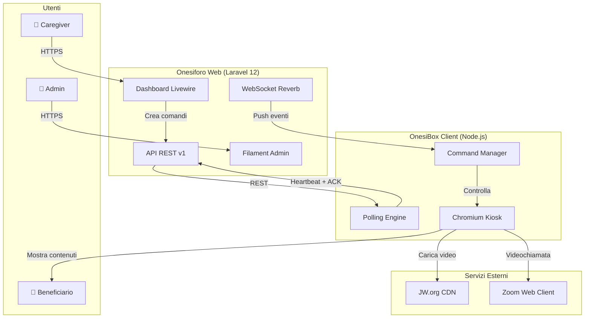

---

## 2. Architettura Backend (Onesiforo Web)

### 2.1 Stack Tecnologico

| Layer | Tecnologia | Versione |
|-------|-----------|---------|
| Framework | Laravel | 12.47.0 |
| PHP | PHP | 8.4.17 |
| Reactive UI | Livewire | 4.x |
| UI Components | Flux UI Free | 2.x |
| Admin Panel | Filament | 5.0 |
| Auth API | Sanctum | 4.x |
| Auth Web | Fortify | 1.x |
| WebSocket | Reverb | 1.x |
| Testing | Pest | 4.x |
| Monitoring | Pulse | 1.x |
| DB (dev) | SQLite | - |
| DB (prod) | MySQL/PostgreSQL | - |

### 2.2 Struttura Directory

```
app/
├── Actions/              # Business logic (13 action classes)
│   ├── AcknowledgeCommandAction
│   ├── AdvancePlaybackSessionAction
│   ├── CancelCommandAction
│   ├── CreatePlaylistAction
│   ├── CreateVolumeCommandAction
│   ├── ExtractJwOrgVideosAction
│   ├── StartPlaybackSessionAction
│   ├── StopPlaybackSessionAction
│   ├── StorePlaybackEventAction
│   └── ProcessHeartbeatAction
├── Concerns/             # Traits riutilizzabili (5)
├── Console/Commands/     # Artisan commands (3)
├── Enums/                # PHP 8.1 enums (11)
├── Events/               # Broadcast events (3)
├── Filament/             # Admin panel resources (4)
├── Http/
│   ├── Controllers/Api/V1/   # API controllers (3)
│   ├── Middleware/            # Custom middleware (1)
│   ├── Requests/Api/V1/      # Form requests (4)
│   └── Resources/Api/V1/     # API resources (5)
├── Livewire/             # Componenti Livewire (17)
│   ├── Dashboard/Controls/   # Controlli OnesiBox (14)
│   └── Settings/             # Impostazioni utente (5)
├── Models/               # Eloquent models (9)
├── Services/             # Service classes (2 + 1 interface)
├── Policies/             # Authorization policies (2)
└── Providers/            # Service providers (3)
```

### 2.3 Domain Model

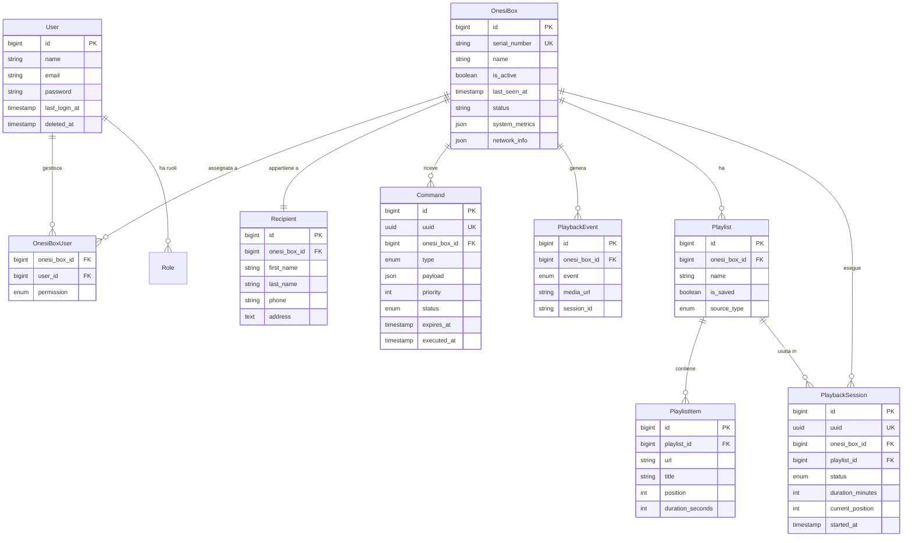

### 2.4 Pattern Architetturali

#### Action Pattern

Tutta la business logic è incapsulata in **Action classes** (`app/Actions/`). I controller e i componenti Livewire delegano alle Action.

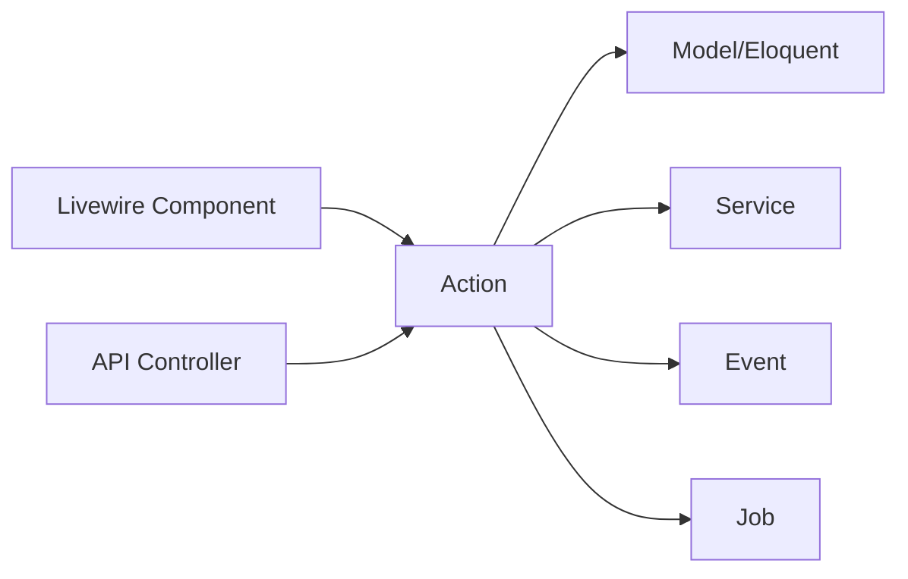

**Vantaggi:**
- Singola responsabilità per operazione
- Facilmente testabili in isolamento
- Riutilizzabili da controller, Livewire, Artisan

#### Service Pattern

I servizi (`app/Services/`) gestiscono logiche trasversali. L'`OnesiBoxCommandService` è il punto centrale per la creazione e dispatch di comandi.

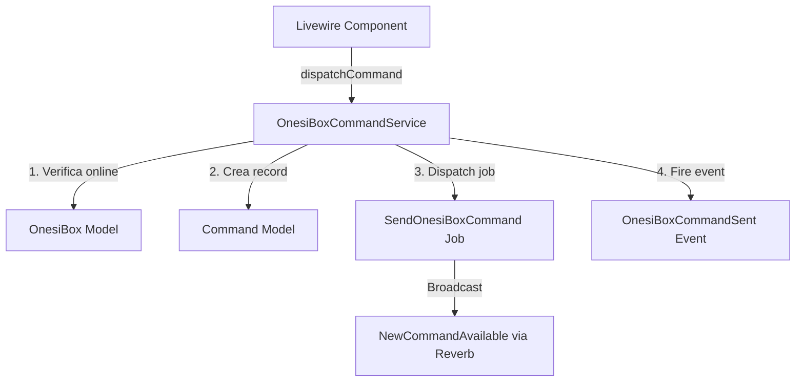

---

## 3. Architettura Client (OnesiBox)

### 3.1 Stack Tecnologico

| Layer | Tecnologia | Versione |
|-------|-----------|---------|
| Runtime | Node.js | >=20 |
| HTTP Client | Axios | 1.13 |
| Browser Control | Playwright | 1.52 |
| WebSocket | pusher-js | 8.4 |
| System Info | systeminformation | 5.30 |
| Logging | Winston + daily-rotate | 3.19 |
| Testing | Jest | 30.2 |
| Target HW | Raspberry Pi | ARM64 |
| Display | Wayland (labwc) | Kiosk mode |

### 3.2 Struttura Directory

```
onesi-box/
├── src/
│   ├── main.js                    # Bootstrap, HTTP server, polling, heartbeat
│   ├── config/config.js           # Configurazione + validazione
│   ├── communication/
│   │   ├── api-client.js          # HTTP client (Axios)
│   │   └── websocket-manager.js   # WebSocket (Pusher/Reverb)
│   ├── commands/
│   │   ├── manager.js             # Pipeline comandi + priorità
│   │   ├── validator.js           # Validazione URL + struttura
│   │   └── handlers/
│   │       ├── media.js           # play/stop/pause/resume + video-ended detection
│   │       ├── zoom.js            # Zoom join/leave via Playwright
│   │       ├── volume.js          # wpctl/pactl/amixer
│   │       ├── system.js          # reboot/shutdown
│   │       ├── service.js         # systemctl restart
│   │       ├── system-info.js     # Diagnostica sistema
│   │       └── logs.js            # Log remoti (sanitizzati)
│   ├── browser/controller.js      # Chromium kiosk (Playwright + fallback spawn)
│   ├── state/state-manager.js     # Stato centralizzato (EventEmitter)
│   ├── logging/
│   │   ├── logger.js              # Winston con rotazione giornaliera
│   │   └── log-sanitizer.js       # Redazione dati sensibili
│   └── watchdog.js                # Integrazione systemd watchdog
├── web/
│   ├── index.html                 # Schermata standby (orologio + stato)
│   ├── player.html                # Player video JW.org
│   ├── app.js                     # Logica standby screen
│   └── styles.css                 # Stili standby
├── config/
│   ├── config.json.example        # Configurazione di esempio
│   └── labwc/                     # Config Wayland compositor
├── scripts/
│   ├── start-kiosk.sh             # Launcher sessione kiosk
│   └── onesibox.service           # Systemd unit template
├── install.sh                     # Script installazione interattivo
├── update.sh                      # Auto-update via git pull
└── tests/unit/                    # Jest unit tests (7 file)
```

### 3.3 Diagramma Componenti

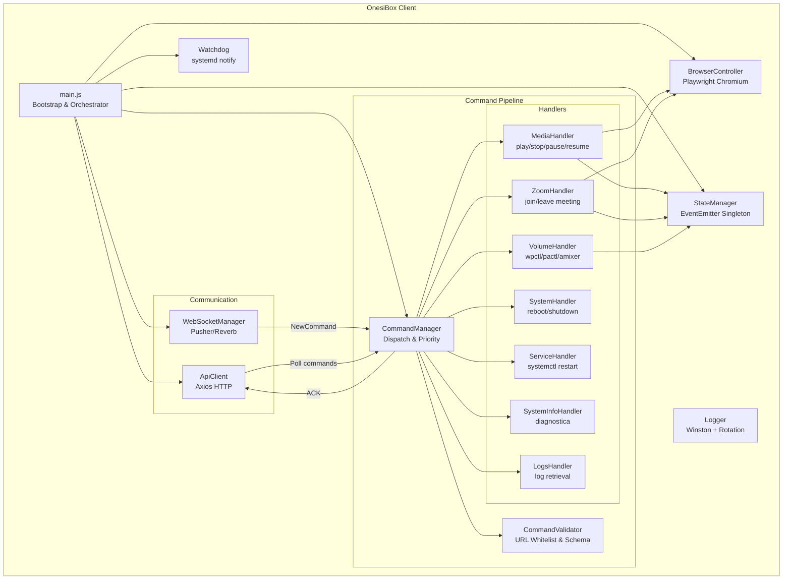

---

## 4. Flusso di Comunicazione

### 4.1 Comunicazione Ibrida (HTTP + WebSocket)

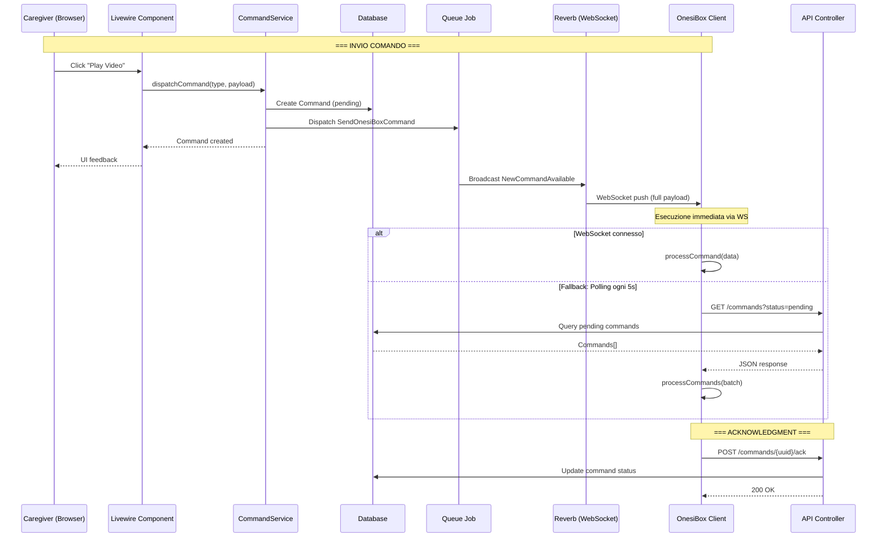

### 4.2 Heartbeat Flow

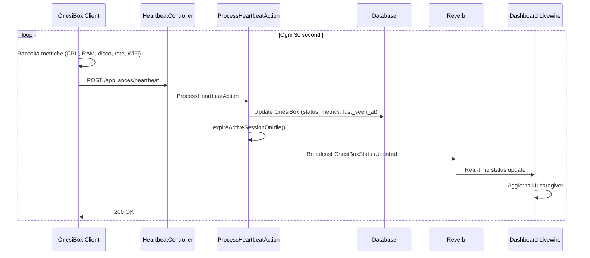

### 4.3 Playlist Session Flow

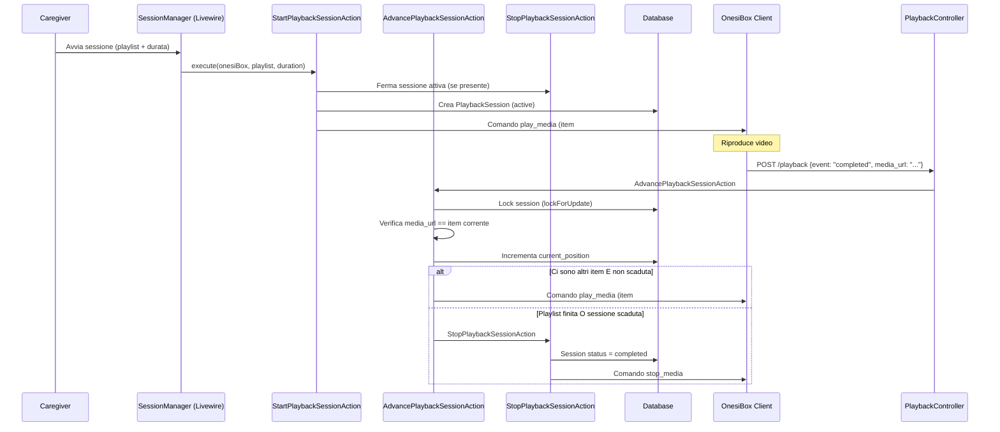

---

## 5. Sicurezza

### 5.1 Modello di Autenticazione

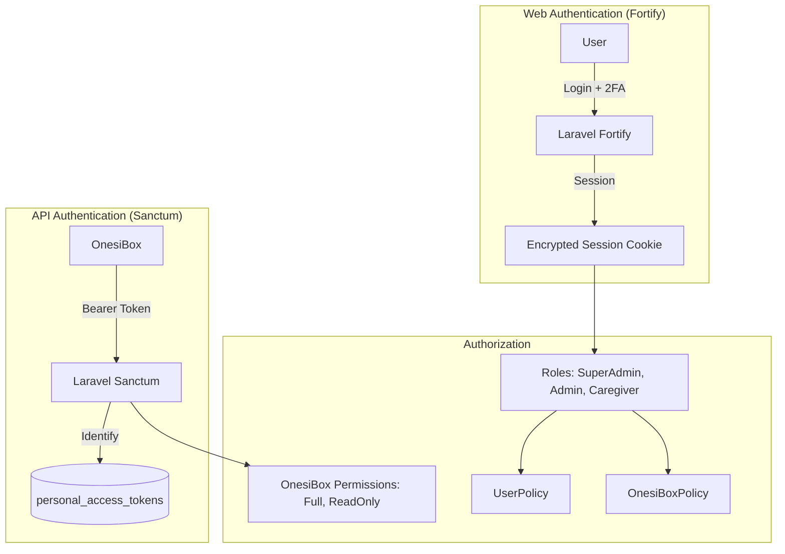

### 5.2 Sicurezza Client

| Protezione | Implementazione |
|-----------|----------------|
| URL Whitelist | Solo domini jw.org, *.jw-cdn.org, *.zoom.us |
| HTTPS Only | Tutte le URL esterne devono essere HTTPS |
| No Shell Injection | Usa `execFile` invece di `exec` |
| Log Sanitization | Redazione token, password, chiavi, email |
| File Permissions | config.json 600 (solo owner) |
| Timing-safe Auth | `crypto.timingSafeEqual` per API key locale |
| Systemd Hardening | ProtectSystem=strict, PrivateTmp=true |
| CSP Headers | Content-Security-Policy su HTTP server locale |

---

## 6. Infrastruttura e Deploy

### 6.1 Architettura di Deploy

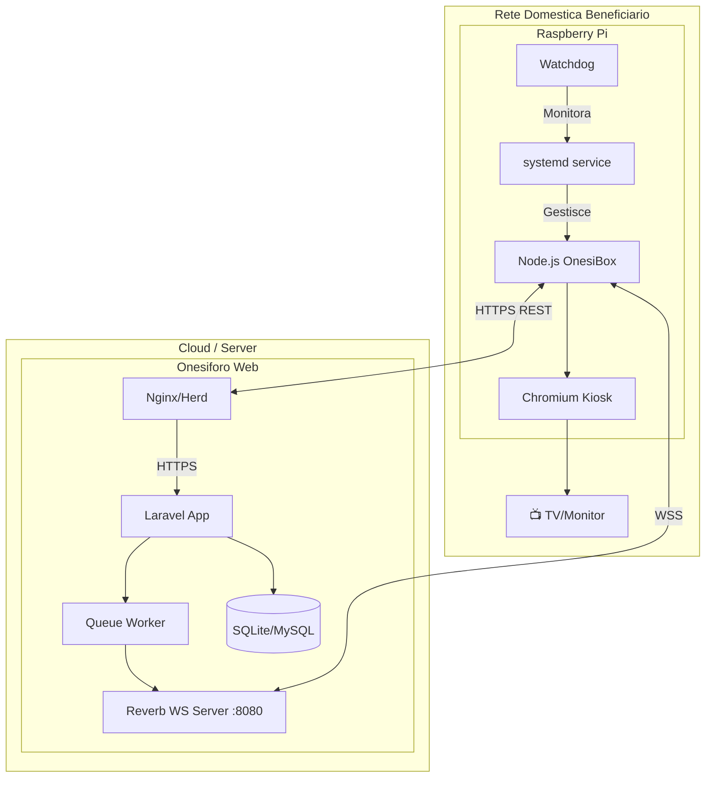

### 6.2 Flusso di Update

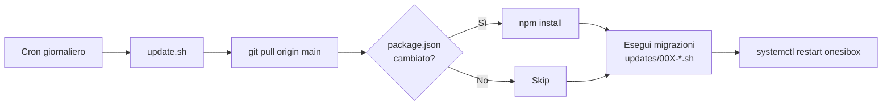

---

## 7. Tipi di Comando Supportati

| Tipo | Priorità | Scadenza | Backend | Client | Note |
|------|----------|----------|---------|--------|------|
| `play_media` | 2 | 60 min | ✅ | ✅ | Video/audio playback |
| `stop_media` | 2 | 5 min | ✅ | ✅ | Ferma riproduzione |
| `pause_media` | 2 | 5 min | ✅ | ✅ | Pausa (solo Playwright) |
| `resume_media` | 2 | 5 min | ✅ | ✅ | Riprendi da pausa |
| `set_volume` | 3 | 5 min | ✅ | ✅ | Volume 0-100 |
| `join_zoom` | 1 | 5 min | ✅ | ✅ | Entra in videochiamata |
| `leave_zoom` | 1 | 5 min | ✅ | ✅ | Esci da videochiamata |
| `reboot` | 1 | 24h | ✅ | ✅ | Riavvio sistema |
| `shutdown` | 1 | 24h | ✅ | ✅ | Spegnimento |
| `restart_service` | 1 | 5 min | ✅ | ✅ | Restart servizio Node |
| `get_system_info` | 4 | 5 min | ✅ | ✅ | Info diagnostiche |
| `get_logs` | 4 | 5 min | ✅ | ✅ | Log remoti |
| `start_jitsi` | - | - | ✅ | ❌ | Non implementato client |
| `stop_jitsi` | - | - | ✅ | ❌ | Non implementato client |
| `speak_text` | - | - | ✅ | ❌ | Non implementato client |
| `show_message` | - | - | ✅ | ❌ | Non implementato client |
| `start_vnc` | - | - | ✅ | ❌ | Non implementato client |
| `stop_vnc` | - | - | ✅ | ❌ | Non implementato client |
| `update_config` | - | - | ✅ | ❌ | Non implementato client |
