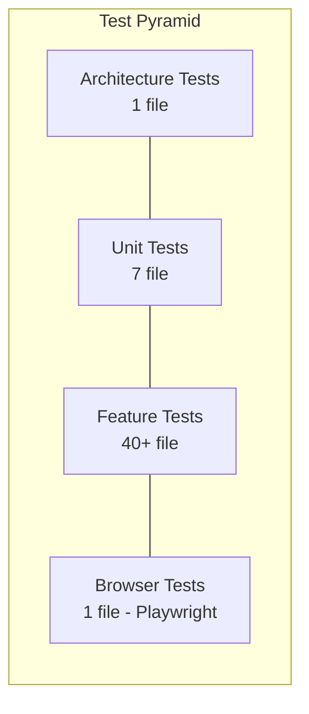
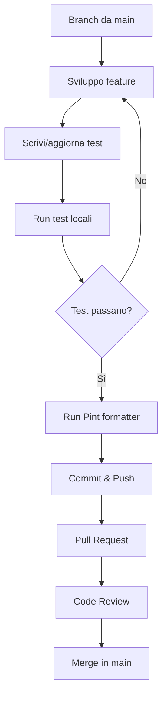

# Guida allo Sviluppo

**Workshop Introduttivo - Febbraio 2026**

---

## 1. Setup Ambiente di Sviluppo

### 1.1 Prerequisiti

| Software | Versione | Note |
|---------|---------|------|
| PHP | 8.4+ | Con estensioni: sqlite3, mbstring, xml, curl, zip |
| Composer | 2.x | Package manager PHP |
| Node.js | 20+ | Per asset frontend e OnesiBox client |
| NPM | 10+ | - |
| Git | 2.x | - |
| Laravel Herd | latest | Serve l'applicazione automaticamente |

### 1.2 Setup Backend (Onesiforo)

```bash
# Clone e setup
cd /path/to/Progetto-Onesiforo
git clone <repo-url> onesiforo
cd onesiforo

# Dipendenze
composer install
npm install

# Ambiente
cp .env.example .env
php artisan key:generate

# Database
touch database/database.sqlite
php artisan migrate --seed

# Build asset
npm run build  # oppure npm run dev per HMR

# L'app è disponibile automaticamente via Herd a:
# https://onesiforo.test
```

### 1.3 Setup Client (OnesiBox)

```bash
cd /path/to/Progetto-Onesiforo
git clone <repo-url> onesi-box
cd onesi-box

npm install

# Configurazione
cp config/config.json.example config/config.json
# Editare config.json con server_url, appliance_id, token

# Avvio in sviluppo
node src/main.js

# Il client è disponibile su http://localhost:3000
```

---

## 2. Convenzioni di Codice

### 2.1 Backend (PHP/Laravel)

#### Naming

| Elemento | Convenzione | Esempio |
|---------|------------|---------|
| Modelli | PascalCase, singolare | `PlaybackSession` |
| Controller | PascalCase + Controller | `HeartbeatController` |
| Action | PascalCase + Action | `StartPlaybackSessionAction` |
| Migration | snake_case, descrittiva | `create_playback_sessions_table` |
| Enum | PascalCase, TitleCase keys | `CommandType::PlayMedia` |
| Traits | PascalCase, descrittiva | `LogsActivityAllDirty` |
| Form Request | PascalCase + Request | `HeartbeatRequest` |
| API Resource | PascalCase + Resource | `CommandResource` |
| Policies | PascalCase + Policy | `OnesiBoxPolicy` |
| Test | PascalCase + Test | `HeartbeatApiTest` |

#### Struttura Controller API

```php
// I controller API sono "thin" - delegano alle Action
class HeartbeatController extends Controller
{
    use AuthorizesAsOnesiBox;
    use HandlesOnesiBoxErrors;

    public function store(HeartbeatRequest $request, ProcessHeartbeatAction $action): JsonResponse
    {
        $onesiBox = $this->authorizeAsOnesiBox($request);
        $action->execute($onesiBox, $request->validated());
        return response()->json(['message' => 'OK']);
    }
}
```

#### Struttura Action

```php
class StartPlaybackSessionAction
{
    public function __construct(
        private OnesiBoxCommandServiceInterface $commandService,
        private StopPlaybackSessionAction $stopAction,
    ) {}

    public function execute(OnesiBox $onesiBox, Playlist $playlist, int $durationMinutes): PlaybackSession
    {
        // 1. Ferma sessione attiva
        // 2. Crea nuova sessione
        // 3. Invia primo comando
        // 4. Ritorna sessione
    }
}
```

#### Regole Importanti

- **Sempre** usare Form Request per la validazione (mai inline nei controller)
- **Sempre** usare `Model::query()` invece di `DB::` per le query
- **Sempre** eager-loading per prevenire N+1
- **Sempre** return type declarations
- **Sempre** constructor property promotion PHP 8.4
- **Mai** usare `env()` fuori dai file config
- **Mai** lasciare metodi `__construct()` vuoti
- **Tutti** i modelli devono usare il trait `LogsActivityAllDirty`

### 2.2 Client (Node.js)

#### Naming

| Elemento | Convenzione | Esempio |
|---------|------------|---------|
| File | kebab-case | `api-client.js` |
| Classi | PascalCase | `CommandManager` |
| Funzioni | camelCase | `processCommand()` |
| Costanti | UPPER_SNAKE | `COMMAND_TYPES` |
| Handler export | camelCase functions | `handlePlayMedia()` |

#### Regole

- **Module format:** CommonJS (`require`/`module.exports`)
- **Async/await** preferito rispetto a `.then()` chains
- **`execFile`** per comandi di sistema (mai `exec`)
- **URL whitelist** obbligatoria per qualsiasi URL esterna

---

## 3. Testing

### 3.1 Backend (Pest 4)



#### Comandi

```bash
# Tutti i test
php artisan test --compact

# Filtro per nome
php artisan test --compact --filter=HeartbeatApiTest

# Singolo file
php artisan test --compact tests/Feature/Api/HeartbeatApiTest.php

# Con coverage
php artisan test --coverage
```

#### Pattern di Test

```php
// Feature test - API
it('processes heartbeat with all fields', function () {
    $onesiBox = OnesiBox::factory()->online()->create();
    $token = $onesiBox->createToken('test')->plainTextToken;

    $response = $this->withToken($token)
        ->postJson('/api/v1/appliances/heartbeat', [
            'status' => 'idle',
            'volume' => 80,
            'cpu_usage' => 45,
            // ...
        ]);

    $response->assertOk();
    expect($onesiBox->fresh()->status)->toBe('idle');
});

// Feature test - Livewire
it('can send play command', function () {
    $user = User::factory()->create();
    $onesiBox = OnesiBox::factory()->online()->create();
    $onesiBox->users()->attach($user, ['permission' => 'full']);

    Livewire::actingAs($user)
        ->test(VideoPlayer::class, ['onesiBox' => $onesiBox])
        ->set('url', 'https://www.jw.org/it/video/123')
        ->call('play')
        ->assertNotified();
});

// Unit test - Action
it('locks command for update during acknowledgment', function () {
    $command = Command::factory()->pending()->create();

    $action = new AcknowledgeCommandAction();
    $action->execute($command, ['status' => 'success', 'executed_at' => now()]);

    expect($command->fresh()->status)->toBe(CommandStatus::Completed);
});
```

### 3.2 Client (Jest 30)

```bash
cd onesi-box

# Tutti i test
npm test

# Con coverage
npm test -- --coverage

# Singolo file
npm test -- tests/unit/commands/validator.test.js
```

---

## 4. Workflow di Sviluppo

### 4.1 Ciclo Feature



### 4.2 Comandi Frequenti

```bash
# === Backend ===

# Creare nuovi file Laravel
php artisan make:model NomeModello -mfs --no-interaction
php artisan make:controller Api/V1/NomeController --no-interaction
php artisan make:test NomeTest --pest --no-interaction
php artisan make:action NomeAction --no-interaction

# Formattazione codice
vendor/bin/pint --dirty --format agent

# Test
php artisan test --compact

# Database
php artisan migrate
php artisan migrate:fresh --seed

# Cache
php artisan optimize:clear

# === Client ===

# Test
npm test

# Lint
npm run lint
```

### 4.3 Code Review Checklist

- [ ] Test scritti/aggiornati per ogni modifica
- [ ] Test passano (`php artisan test --compact`)
- [ ] Pint formattato (`vendor/bin/pint --dirty`)
- [ ] Nessuna query N+1 introdotta
- [ ] Form Request usata per validazione API
- [ ] Nessun `env()` fuori dai file config
- [ ] Nessun dato sensibile hardcoded
- [ ] Return type declarations su tutti i metodi
- [ ] Trait `LogsActivityAllDirty` su nuovi modelli
- [ ] Documentazione aggiornata se necessario

---

## 5. API Development

### 5.1 Aggiungere un Nuovo Endpoint

1. **Route** in `routes/api.php`:
```php
Route::post('v1/appliances/new-endpoint', [NewController::class, 'store'])
    ->middleware('throttle:appliance-new')
    ->name('api.v1.appliances.new-endpoint');
```

2. **Form Request** per la validazione:
```bash
php artisan make:request Api/V1/NewEndpointRequest --no-interaction
```

3. **Controller** thin che delega all'Action:
```bash
php artisan make:controller Api/V1/NewController --no-interaction
```

4. **Action** con la business logic:
```bash
php artisan make:action NewAction --no-interaction
```

5. **API Resource** per la risposta:
```bash
php artisan make:resource Api/V1/NewResource --no-interaction
```

6. **Test**:
```bash
php artisan make:test Api/NewEndpointTest --pest --no-interaction
```

### 5.2 Aggiungere un Nuovo Tipo di Comando

1. Aggiungere il case in `CommandType` enum
2. Definire scadenza in `CommandType::expiresInMinutes()`
3. Definire priorità in `CommandType::defaultPriority()`
4. Aggiungere label in `CommandType::label()`
5. Aggiungere la validazione payload in `OnesiBoxCommandService` (se necessaria)
6. **Client**: Aggiungere tipo in `COMMAND_TYPES` del validator
7. **Client**: Creare handler in `commands/handlers/`
8. **Client**: Registrare handler in `main.js`
9. **Test**: Backend + Client

### 5.3 Aggiungere un Componente Livewire

```bash
# Crea componente + vista
php artisan make:livewire Dashboard/Controls/NuovoComponente --no-interaction
```

Pattern standard:
```php
class NuovoComponente extends Component
{
    use ChecksOnesiBoxPermission;  // Verifica permessi
    use HandlesOnesiBoxErrors;     // Gestione errori

    public OnesiBox $onesiBox;

    public function mount(OnesiBox $onesiBox): void
    {
        $this->onesiBox = $onesiBox;
        $this->requireFullPermission();  // O requireViewPermission()
    }

    #[Computed]
    public function qualcosa(): mixed
    {
        return $this->onesiBox->qualcosa;
    }

    public function azione(): void
    {
        $this->requireOnline();
        // ... logica
    }

    public function render(): View
    {
        return view('livewire.dashboard.controls.nuovo-componente');
    }
}
```

---

## 6. Database

### 6.1 Creare una Migrazione

```bash
php artisan make:migration create_nuova_tabella_table --no-interaction
```

**Regole:**
- Sempre aggiungere indici per le colonne usate in WHERE/JOIN
- Sempre aggiungere foreign key constraints
- Quando si modifica una colonna, includere TUTTI gli attributi precedenti
- Usare `uuid` per identificatori pubblici/API

### 6.2 Creare un Model con Factory e Seeder

```bash
php artisan make:model NuovoModello -mfs --no-interaction
```

Questo crea:
- `app/Models/NuovoModello.php`
- `database/migrations/xxxx_create_nuovo_modellos_table.php`
- `database/factories/NuovoModelloFactory.php`
- `database/seeders/NuovoModelloSeeder.php`

**Checklist Model:**
- [ ] Aggiungere `use LogsActivityAllDirty;`
- [ ] Definire `$fillable` o `$guarded`
- [ ] Definire `casts()` method
- [ ] Definire relazioni Eloquent con return type
- [ ] Creare stati nella Factory (`->online()`, `->active()`, etc.)
