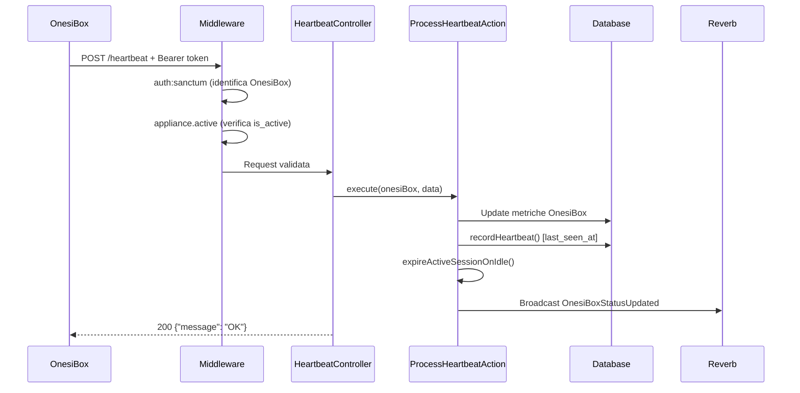

# API Reference - Onesiforo v1

**Workshop Introduttivo - Febbraio 2026**

---

## 1. Panoramica

Tutte le API sono sotto il prefisso `/api/v1/` e richiedono autenticazione Sanctum via Bearer token.

### Autenticazione

```
Authorization: Bearer {sanctum_token}
```

Il token identifica l'appliance OnesiBox. Non è necessario passare un appliance ID nelle URL.

### Middleware

Tutti gli endpoint applicano:
1. `auth:sanctum` - Verifica token
2. `appliance.active` - Verifica che l'appliance sia attiva (`is_active = true`)

### Rate Limiting

| Endpoint | Limite |
|---------|--------|
| Heartbeat | 4 richieste/minuto |
| Commands (poll) | 20 richieste/minuto |
| Playback events | 30 richieste/minuto |
| Command ACK | 60 richieste/minuto |

### Risposte Errore Standard

```json
// 401 - Non autenticato
{ "message": "Unauthenticated." }

// 403 - Appliance disabilitata
{ "message": "Appliance disabilitata.", "error_code": "E003" }

// 422 - Validazione fallita
{
  "message": "Il campo status è obbligatorio.",
  "errors": {
    "status": ["Il campo status è obbligatorio."]
  }
}

// 429 - Rate limit superato
{ "message": "Too Many Attempts." }
```

---

## 2. Endpoints

### 2.1 Heartbeat

```
POST /api/v1/appliances/heartbeat
```

Invia lo stato corrente e le metriche dell'appliance al server.

#### Request Body

```json
{
  "status": "idle",
  "current_media": {
    "url": "https://www.jw.org/...",
    "type": "video",
    "position": 120,
    "duration": 300
  },
  "current_meeting": null,
  "volume": 80,
  "cpu_usage": 45.2,
  "memory_usage": 62,
  "disk_usage": 35,
  "temperature": 52.3,
  "uptime": 86400,
  "app_version": "1.2.3",
  "network": {
    "type": "wifi",
    "interface": "wlan0",
    "ip": "192.168.1.100",
    "mac": "AA:BB:CC:DD:EE:FF",
    "gateway": "192.168.1.1"
  },
  "wifi": {
    "ssid": "HomeNetwork",
    "signal_dbm": -65,
    "signal_percent": 70,
    "channel": 6,
    "frequency": 2437,
    "security": "WPA2"
  },
  "memory": {
    "total": 4096,
    "used": 2500,
    "free": 1596
  }
}
```

#### Validazione

| Campo | Tipo | Obbligatorio | Regole |
|-------|------|:---:|--------|
| `status` | string | ✅ | `idle\|playing\|calling\|error` |
| `current_media` | object | - | Nullable |
| `current_media.url` | string | ✅* | URL valida, max 2048 |
| `current_media.type` | string | ✅* | `audio\|video` |
| `current_media.position` | integer | - | Nullable, >=0 |
| `current_media.duration` | integer | - | Nullable, >=0 |
| `current_meeting` | object | - | Nullable |
| `current_meeting.meeting_id` | string | ✅* | Max 255 |
| `current_meeting.meeting_url` | string | - | URL valida |
| `current_meeting.joined_at` | datetime | - | ISO 8601 |
| `volume` | integer | - | 0-100 |
| `cpu_usage` | numeric | - | 0-100 |
| `memory_usage` | numeric | - | 0-100 |
| `disk_usage` | numeric | - | 0-100 |
| `temperature` | numeric | - | -50 a 150 |
| `uptime` | integer | - | >=0 |
| `app_version` | string | - | Max 20 |
| `network` | object | - | Nullable |
| `wifi` | object | - | Nullable |
| `memory` | object | - | Nullable |

#### Response

```json
// 200 OK
{ "message": "OK" }
```

#### Diagramma di Sequenza



---

### 2.2 Commands (Poll)

```
GET /api/v1/appliances/commands
```

Recupera i comandi in attesa per l'appliance. I comandi scaduti vengono automaticamente marcati come `expired`.

#### Query Parameters

| Parametro | Tipo | Default | Note |
|----------|------|---------|------|
| `status` | string | `pending` | Filtra per stato |

#### Response

```json
{
  "data": [
    {
      "id": "550e8400-e29b-41d4-a716-446655440000",
      "type": "play_media",
      "payload": {
        "url": "https://www.jw.org/it/video/123",
        "media_type": "video",
        "session_id": "660e8400-e29b-41d4-a716-446655440001"
      },
      "priority": 2,
      "status": "pending",
      "created_at": "2026-02-27T10:00:00+00:00",
      "expires_at": "2026-02-27T11:00:00+00:00"
    }
  ],
  "meta": {
    "total": 5,
    "pending": 1
  }
}
```

I comandi sono ordinati per priorità (1=massima) e poi per data creazione.

---

### 2.3 Command Acknowledgment

```
POST /api/v1/commands/{uuid}/ack
```

Conferma l'esecuzione di un comando. Operazione idempotente.

#### URL Parameters

| Parametro | Tipo | Note |
|----------|------|------|
| `uuid` | string | UUID del comando |

#### Request Body

```json
{
  "status": "success",
  "executed_at": "2026-02-27T10:05:00.000Z",
  "error_code": null,
  "error_message": null,
  "result": null
}
```

#### Validazione

| Campo | Tipo | Obbligatorio | Regole |
|-------|------|:---:|--------|
| `status` | string | ✅ | `success\|failed\|skipped` |
| `executed_at` | datetime | ✅ | ISO 8601 |
| `error_code` | string | - | Nullable, max 10 |
| `error_message` | string | - | Nullable, max 1000 |
| `result` | object | - | Nullable (per get_system_info, get_logs) |

#### Response

```json
// 200 OK
{ "message": "Comando confermato." }

// 404 Not Found
{ "message": "Comando non trovato.", "error_code": "E002" }

// 403 Forbidden (comando di altra appliance)
{ "message": "Comando non autorizzato per questa appliance.", "error_code": "E003" }
```

---

### 2.4 Playback Events

```
POST /api/v1/appliances/playback
```

Registra un evento di riproduzione media.

#### Request Body

```json
{
  "event": "completed",
  "media_url": "https://www.jw.org/it/video/123",
  "media_type": "video",
  "position": 300,
  "duration": 300,
  "session_id": "660e8400-e29b-41d4-a716-446655440001",
  "error_message": null
}
```

#### Validazione

| Campo | Tipo | Obbligatorio | Regole |
|-------|------|:---:|--------|
| `event` | string | ✅ | `started\|paused\|resumed\|stopped\|completed\|error` |
| `media_url` | string | ✅ | URL valida, max 2048 |
| `media_type` | string | ✅ | `audio\|video` |
| `position` | integer | - | Nullable, >=0 |
| `duration` | integer | - | Nullable, >=0 |
| `session_id` | string | - | UUID nullable |
| `error_message` | string | - | Nullable, max 1000 |

#### Comportamento Speciale

Quando l'evento è `completed` o `error` e c'è un `session_id`, il server invoca automaticamente `AdvancePlaybackSessionAction` per avanzare alla prossima traccia della playlist.

#### Response

```json
// 201 Created
{ "message": "Evento registrato." }
```

---

## 3. WebSocket (Reverb)

### 3.1 Canali

| Canale | Formato | Autenticazione | Destinatario |
|--------|---------|---------------|-------------|
| `onesibox.{id}` | Private | User con permesso view | Dashboard caregiver |
| `appliance.{serialNumber}` | Private | OnesiBox con serial match | Client OnesiBox |

### 3.2 Eventi

#### `OnesiBoxStatusUpdated` (Canale: `onesibox.{id}`)

Broadcast su ogni heartbeat. Contiene lo stato aggiornato dell'appliance.

```json
{
  "status": "playing",
  "is_online": true,
  "current_media": { "url": "...", "type": "video" },
  "volume": 80,
  "cpu_usage": 45,
  "last_seen_at": "2026-02-27T10:00:00Z"
}
```

#### `NewCommandAvailable` (Canale: `appliance.{serialNumber}`)

Push immediato quando un comando viene creato.

```json
{
  "uuid": "550e8400-e29b-41d4-a716-446655440000",
  "type": "play_media",
  "priority": 2,
  "payload": { "url": "...", "media_type": "video" },
  "expires_at": "2026-02-27T11:00:00.000Z"
}
```

---

## 4. Codici Errore Client

Il client OnesiBox usa codici errore strutturati nel campo `error_code` dell'ACK:

| Codice | Significato |
|--------|------------|
| `E001` | Comando scaduto |
| `E002` | Comando non trovato |
| `E003` | Non autorizzato |
| `E004` | Comando expired (validazione client) |
| `E005` | Validazione payload fallita |
| `E006` | Tipo comando sconosciuto |
| `E101` | URL non consentita (whitelist) |
| `E102` | Errore navigazione browser |
| `E103` | Zoom: errore join/leave |
| `E104` | Volume: errore impostazione |
| `E105` | Sistema: errore reboot/shutdown |
| `E106` | Servizio: errore restart |
| `E107` | System info: errore raccolta dati |
| `E108` | Logs: errore recupero log |
