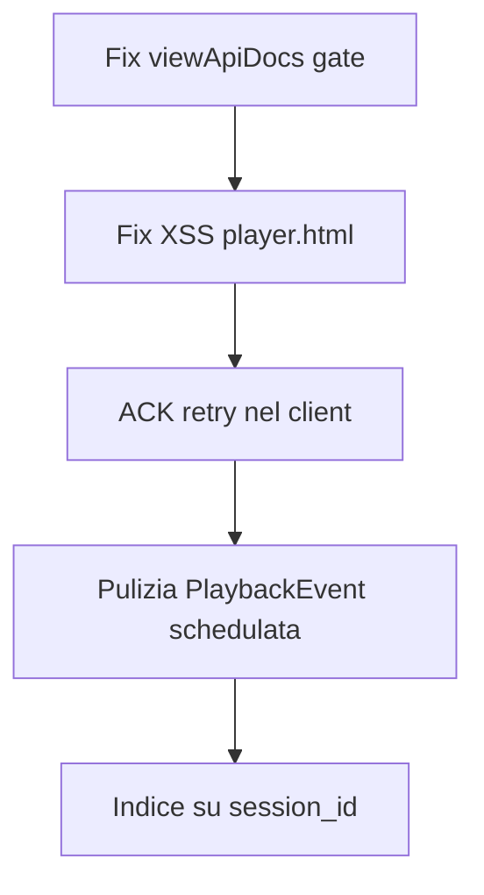
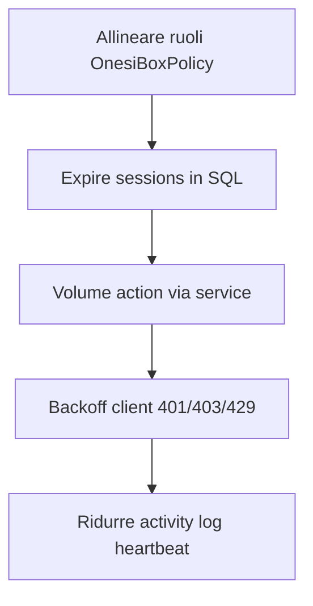
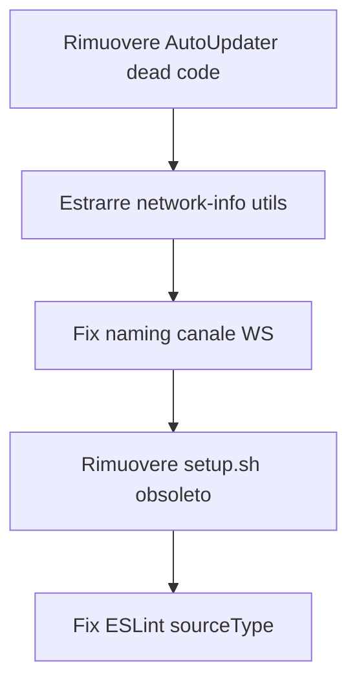

# Analisi del Codice e Opportunità di Refactoring

**Workshop Introduttivo - Febbraio 2026**

---

## 1. Riepilogo della Codebase

| Metrica | Backend (Onesiforo) | Client (OnesiBox) |
|---------|:---:|:---:|
| Linguaggio | PHP 8.4 | Node.js 20 |
| Modelli/Entità | 9 | - |
| Actions/Services | 13 + 2 | - |
| Controller API | 3 | - |
| Componenti Livewire | 17 | - |
| Command Handlers | - | 7 moduli |
| Test file | 57 | 7 |
| Test totali | 566+ | ~50 |
| Tipi comando backend | 19 | 12 (7 non implementati) |

---

## 2. Problemi Critici

### 2.1 [BACKEND] Gate `viewApiDocs` sempre aperto

**File:** `app/Providers/AppServiceProvider.php`

```php
Gate::define('viewApiDocs', fn (User $user): bool => true);
```

**Problema:** Qualsiasi utente autenticato può vedere la documentazione API (Scramble). Dovrebbe essere limitato agli admin.

**Fix:**
```php
Gate::define('viewApiDocs', fn (User $user): bool => $user->hasAnyRoles(Roles::SuperAdmin, Roles::Admin));
```

---

### 2.2 [BACKEND] `CreateVolumeCommandAction` bypassa il service

**File:** `app/Actions/CreateVolumeCommandAction.php`

**Problema:** Crea comandi direttamente senza passare da `OnesiBoxCommandService`. Questo:
- Salta il controllo `ensureOnline()` (crea comandi per box offline)
- Non dispatcha l'evento `OnesiBoxCommandSent` (nessun audit log)

**Fix:** Redirigere tramite `OnesiBoxCommandService::dispatchCommand()`.

---

### 2.3 [BACKEND] Nessuna pulizia dei PlaybackEvent

**File:** `app/Models/PlaybackEvent.php` (docblock dice "30 giorni")

**Problema:** Non esiste un comando schedulato per eliminare i vecchi eventi. I dati cresceranno indefinitamente.

**Fix:** Creare un `PrunePlaybackEventsCommand` schedulato giornalmente:
```php
// app/Console/Commands/PrunePlaybackEventsCommand.php
PlaybackEvent::where('created_at', '<', now()->subDays(30))->delete();
```

---

### 2.4 [CLIENT] XSS in `player.html`

**File:** `web/player.html` (linea ~92)

```javascript
document.getElementById('container').innerHTML = `
  <video id="player" autoplay controls>
    <source src="${videoUrl}" type="video/mp4">
  </video>
`;
```

**Problema:** `videoUrl` viene inserito in `innerHTML` senza sanitizzazione. Un URL malevolo dal CDN potrebbe iniettare HTML/JS.

**Fix:** Usare DOM API:
```javascript
const video = document.createElement('video');
video.id = 'player';
video.autoplay = true;
video.controls = true;
const source = document.createElement('source');
source.src = videoUrl;
source.type = 'video/mp4';
video.appendChild(source);
container.innerHTML = '';
container.appendChild(video);
```

---

### 2.5 [CLIENT] Nessun retry per ACK falliti

**File:** `src/commands/manager.js`

**Problema:** Se l'invio dell'ACK fallisce (rete instabile), il server non saprà che il comando è stato eseguito. Al prossimo polling, il comando pendente verrà ri-processato (duplicazione).

**Fix:** Implementare una coda di retry per gli ACK falliti, processata ad ogni polling cycle.

---

### 2.6 [CLIENT] Race condition reboot/shutdown

**File:** `src/commands/handlers/system.js`

```javascript
// Invia ACK, poi aspetta 1 secondo e riavvia
setTimeout(() => { execFile('sudo', ['reboot']); }, 1000);
```

**Problema:** Se l'ACK HTTP impiega più di 1 secondo, il sistema riavvia prima che l'ACK arrivi al server.

**Fix:** Attendere il completamento dell'ACK prima del reboot:
```javascript
// L'ACK viene inviato dal manager - aspettare un segnale di conferma
// oppure aumentare il delay a 3-5 secondi
```

---

## 3. Problemi Moderati

### 3.1 [BACKEND] Inconsistenza ruoli in `OnesiBoxPolicy`

**File:** `app/Policies/OnesiBoxPolicy.php`

```php
// ❌ Usa stringhe
$user->hasAnyRoles('super-admin', 'admin')

// ✅ UserPolicy usa enum
$user->hasAnyRoles(Roles::SuperAdmin, Roles::Admin)
```

**Fix:** Allineare `OnesiBoxPolicy` all'uso dell'enum `Roles`.

---

### 3.2 [BACKEND] `ExpirePlaybackSessionsCommand` carica tutto in memoria

**File:** `app/Console/Commands/ExpirePlaybackSessionsCommand.php`

```php
// ❌ Carica tutte le sessioni e filtra in PHP
PlaybackSession::active()->get()->filter(fn ($s) => $s->hasExpired());

// ✅ Filtrare in SQL
PlaybackSession::active()
    ->whereRaw("datetime(started_at, '+' || duration_minutes || ' minutes') <= datetime('now')")
    ->get();
```

---

### 3.3 [BACKEND] `playback_events.session_id` senza indice

**File:** `database/migrations/*_add_session_id_to_playback_events_table.php`

La colonna `session_id` (UUID) non ha un indice. Le query per analisi sessione saranno lente.

**Fix:** Aggiungere migrazione con indice:
```php
$table->index('session_id');
```

---

### 3.4 [BACKEND] Heartbeat genera troppo activity log

`ProcessHeartbeatAction` salva l'intero OnesiBox ad ogni heartbeat (ogni 30s per box). Il trait `LogsActivityAllDirty` logga ogni campo modificato. Con N box online, questo genera `N * 2 * 60 * 24 = 2880*N` record activity_log al giorno.

**Fix:** Escludere i campi telemetria dal logging:
```php
protected static array $logAttributesIgnore = [
    'cpu_usage', 'memory_usage', 'disk_usage', 'temperature', 'uptime',
    'last_seen_at', 'network_type', 'signal_dbm', // etc.
];
```

---

### 3.5 [CLIENT] 7 tipi di comando non implementati

| Tipo Backend | Stato Client |
|-------------|-------------|
| `start_jitsi` | Non implementato |
| `stop_jitsi` | Non implementato |
| `speak_text` | Non implementato |
| `show_message` | Non implementato |
| `start_vnc` | Non implementato |
| `stop_vnc` | Non implementato |
| `update_config` | Non implementato |

Il client li rifiuta correttamente con errore `E006`, ma il backend potrebbe inviarli dalla UI.

**Fix:** O implementare i handler mancanti nel client, oppure impedire la creazione di questi comandi nel backend fino a quando non sono supportati.

---

### 3.6 [CLIENT] Nessun backoff per errori 401/403/429

**File:** `src/communication/api-client.js`

Il client non distingue tra errori transitori (503, timeout) e permanenti (401 token revocato, 403 box disabilitata). Continua a pollare indefinitamente anche con token invalido.

**Fix:**
- 401/403: Entrare in stato "dormant", smettere di pollare, loggare warning
- 429: Implementare exponential backoff

---

### 3.7 [CROSS] Naming inconsistente canale WebSocket

**Backend:** `appliance.{$this->command->onesiBox->serial_number}`
**Client:** `private-appliance.${config.appliance_id}`

Il campo config `appliance_id` deve contenere il `serial_number`. Il nome è fuorviante.

**Fix:** Rinominare il campo config in `serial_number` oppure documentare chiaramente che `appliance_id` = serial number del dispositivo.

---

### 3.8 [CLIENT] Dead code: `AutoUpdater`

**File:** `src/update/auto-updater.js` (211 righe)

La classe non è mai importata da nessuna parte. L'auto-update è gestito da `update.sh` + cron.

**Fix:** Rimuovere il file o integrarlo nel ciclo di vita dell'applicazione.

---

### 3.9 [CLIENT] Logica rete duplicata

**File:** `src/main.js` (heartbeat) e `src/commands/handlers/system-info.js`

Entrambi raccolgono informazioni di rete con codice simile ma non identico.

**Fix:** Estrarre in un modulo shared `src/utils/network-info.js`.

---

### 3.10 [BACKEND] `Model::unguard()` con `shouldBeStrict()`

**File:** `app/Providers/AppServiceProvider.php`

```php
Model::shouldBeStrict();  // Abilita protezioni
Model::unguard();         // ... ma disabilita mass assignment protection
```

Queste due istruzioni sono parzialmente in contraddizione.

**Fix:** Rimuovere `unguard()` e definire correttamente `$fillable` su tutti i modelli.

---

## 4. Miglioramenti Proposti

### 4.1 Priorità Alta



### 4.2 Priorità Media



### 4.3 Priorità Bassa (Pulizia)



---

## 5. Gap nei Test

### 5.1 Backend - Componenti non testati

| Componente | File | Criticità |
|-----------|------|:---------:|
| `PlaylistBuilder` (Livewire) | - | Alta |
| `SavedPlaylists` (Livewire) | - | Media |
| `SessionManager` (Livewire) | - | Media |
| `CreatePlaylistAction` | - | Media |
| `ProcessHeartbeatAction` (dettaglio) | - | Media |
| `JwOrgUrl` / `JwOrgSectionUrl` (Rules) | - | Bassa |
| Notifications (2) | - | Bassa |
| `MediaPlayer` abstract + Audio/Video | - | Bassa |

### 5.2 Client - Moduli non testati

| Modulo | File | Criticità |
|--------|------|:---------:|
| `media.js` (handler) | handlers/media.js | **Critica** |
| `manager.js` (pipeline) | commands/manager.js | **Critica** |
| `controller.js` (browser) | browser/controller.js | Alta |
| `websocket-manager.js` | communication/ | Media |
| `zoom.js` (handler) | handlers/zoom.js | Media |
| `volume.js` (handler) | handlers/volume.js | Bassa |
| `service.js` (handler) | handlers/service.js | Bassa |
| `web/player.html` | web/ | Media |
| `web/app.js` | web/ | Bassa |

### 5.3 Test Mancanti Cross-System

- Nessun test di integrazione end-to-end (backend + client)
- Nessun test di contract per verificare compatibilità API
- Nessun test di performance/load per polling con molte appliance
